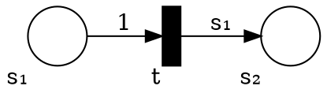

# Bonus Exercises 1

_Instructions_
* Optional.
* Due on Tuesday Feb 5.

## Generalized Nets

Let us consider a new extension of Petri nets call _Generalized nets_ (G-nets).
G-nets generalizes the edges to polynomials (over ℕ).

The weight $w$ function in the definition of Petri Nets is generalized to $(S × T) ∪ (T × S) → ℕ[S]$.
The weight on the edges are of the form $∑_i c_i⋅M(i)^{n_i} + d$ with $c_i$,$n_i$, $d$ ∈ ℕ.

Normal Petri nets transitions are special case where $c_i = n_i = 0$.

A transfer arc of transition $t$ from place $s₁$ to $s₂$ has $w(s₁,t) = s₁$ and $w(t,s₂) = s₁$.

A _Post G-net_ is a G-net where only the edges from transition to places are generalized net.
The transition from places to transitions are normal Petri net transitions.

_Example._
This is a Post G-net:

If we start with the marking $(s₁ = n, s₂ = 0)$ and fire $t$ until $s₁$ is empty then $s₂ = n(n+1)/2$.


__Tasks.__
* Are Post G-net WSTS? If yes give a proof, otherwise give a counterexample.
* Are G-nets WSTS? If yes give a proof, otherwise give a counterexample.


## New perspective on DFA minimization

Let us look at a simplified version of Hopcroft's algorithm for DFA minimization.

Given a DFA $(Q, Σ, δ, q₀, F)$, the algorithm is

```
P₁ := {}
P₂ := {F, Q - F}   //partition the accepting and non-accepting states
while (P₁ ≠ P₂)
    P₁ := P₂
    P₂ := refine(P₂)
construct_dfa(P₁)
```
with the auxiliary method `refine`:
```
refine(P)
    P′ = {} //refined partition
    for each S ∈ P
        partition S into subsets such x,y ∈ S are in the same subset of S
        if and only if ∀ a∈Σ. ∃ S′ ∈ P. δ(x,a) ∈ S′ ∧ δ(y,a) ∈ S′

        add the newly formed subsets as the output partition P′
        if S is not partitioned in this process, add S to P′
    return P′
```
with the auxiliary method `construct_dfa`:
```
construct_dfa(P)
    let p₀ ∈ P be the set such that q₀ ∈ p₀
    F′ = { p ∈ P | p ⊆ F }
    δ′(p, a) = p′ such that p,p′ ⊆ P and ∃ q ∈ p. δ(q, a) ∈ p′
    return (P, Σ, δ′, p₀, F′)
```

__Task.__
Explain what the algorithm above is doing in terms of (bi)simulation.

## CSM Synchronizability

Communicating state machines are hard to analyse (undecidable with reliable FIFO channels).
Finding subclasses of CSM that can be analysed is an ongoing research topic.

A few years ago (around 2011-2012) the idea of _synchronizability_ was proposed and published in peer-reviewed conferences and journals.
The goal is to identify systems which do not use the channels as an auxiliary memory.
The idea was the following: a system of CSM is synchronizable if any asynchronous trace can be mimicked by a synchronous one that contains the same send actions in the same order.
The claim was that if a system has the same traces with a synchronous semantics and a 1-bounded channels then it has the same traces for any channel size and unbounded channels.

In the setting of our class, the claim is that if for a system of CSM it cannot be distinguished (control-state reachability) between synchronous+reliable semantics and 1-bounded+reliable+FIFO+p2p semantics then a control state is reachable iff it is reachable with a synchronous-reliable semantics.
Unfortunately, the claim was not true.

__Tasks.__
* If the claim was true, what would be the benefit to analyse CSM? How hard would it be to analyse synchronizable CSM?
* Can you find an example that shows the claim is not true?

