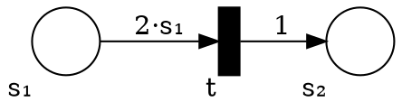

# Bonus Solutions 1

## Generalized Nets

#### Task: Are Post G-net WSTS?

Yes.
This comes from the fact that the outgoing edges have functions of the form: $∑_i c_i⋅M(i)^{n_i} + d$ with $c_i$, $n_i$, $d$ ∈ ℕ.
These functions are monotonic because all the parameters are in ℕ.

#### Task: Are G-nets WSTS?

No.
We can emulate inhibitory edges:


The transition can fire only when $s₁$ is empty.


## New Perspective on DFA Minimization

The algorithm is progressively refining equivalence classes according to how many transitions are needed to distinguish states.

When the algorithm starts, it there two classes the accepting or non-accepting states.
The state can be distinguished without taking any transitions.
After one iteration, we have the sets of state are can be distinguished with 0 or 1 transitions.
Etc.

In terms of bisimulation, the equivalence classes are bisimilar up to $i$ transitions where $i$ is the number of iteration of the algorithm.
For any two state in the same equivalence class, using at most $i$ transitions, it is not possible to have one reach an accepting state and the other not.

In this end, the minimal automata is the automata where all the bisimilar states have been merged.


## CSM Synchronizability

#### Task 1

Computing the set of traces with synchronous and 1-bounded semantics is possible.
The model is equivalent to finite state machines.
(Most problems on finite state machine have a PSpace complexity.)

On the other hand, CSM with reliable FIFO channels is a Turing complete model of computation.
Therefore, we would have an effective test find a decidable subclass of a Turing complete model.
(*head explode*)

Actually, synchronizability is [undecidable](https://arxiv.org/abs/1702.07213) for p2p communication.
_Caveat._ The actual result is a bit more complicated.
The setting has been sightly simplified for this exercise.

#### Task 2

Here is a variation of the example for difference between p2p and mailbox:

* **A**
    ```graphviz
    digraph a {
        rankdir=LR;
        node [shape = circle];
        init [shape = none, label = ""];
        A [label = "a1"];
        B [label = "a2"];
        C [label = "a3"];
        D [label = "a4"];
        init -> A;
        A -> B [ label = "C!X" ];
        B -> C [ label = "C!X" ];
        C -> D [ label = "B!Y" ];
    }
    ```
* **B**
    ```graphviz
    digraph b {
        rankdir=LR;
        node [shape = circle];
        init [shape = none, label = ""];
        A [label = "b1"];
        B [label = "b2"];
        C [label = "b3"];
        init -> A;
        A -> B [ label = "?Y" ];
        B -> C [ label = "C!Z" ];
    }
    ```
* **C**
    ```graphviz
    digraph b {
        rankdir=LR;
        node [shape = circle];
        init [shape = none, label = ""];
        A [label = "c1"];
        B [label = "c2"];
        C [label = "c3"];
        D [label = "c4"];
        E [label = "c5"];
        F [label = "c6"];
        G [label = "c7"];
        init -> A;
        A -> B [ label = "?X" ];
        B -> C [ label = "?X" ];
        C -> D [ label = "?Z" ];
        A -> E [ label = "?Z" ];
        E -> F [ label = "?X" ];
        F -> G [ label = "?X" ];
    }
    ```

With synchronous and 1-bounded semantics, in C we can only reach c₁, c₂, c₃, c₄.
With unbounded FIFO, we can also reach c₅, c₆, c₇.
