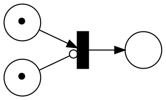
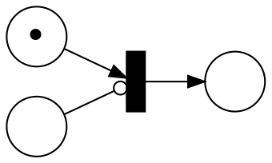
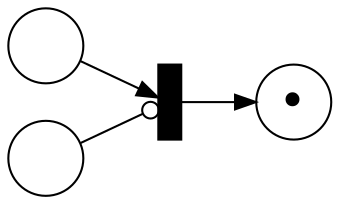

# Homework 2

_Instructions_
* Due on November 6.
* Send your solution by email o Simin Oraee.
* You can work in groups up to 3 people, be sure to include the names of all the participants.
* You can submit your solution in pdf or text format. For the exercises using Spin give the promela source file as well. Place all your files in a single archive (zip or tar.gz).

## Synchronized Product for DFAs/NFAs with Different Alphabets

During the first week, we have seen a version of the product of DFA called the synchronized product.
Let explore this construction further.

The synchronized product is able to deal with machines with different alphabets.

Given two DFAs $A = (Q_A, Σ, δ_A, q₀_A, F_A)$ and $B = (Q_B, Σ, δ_B, q₀_B, F_B)$ with the _same_ alphabet.
Let the simple product $A⋅B = (Q, Σ, δ, q₀, F)$ be
* $Q = Q_A × Q_B$
* $δ((q_A,q_B), a) = (δ_A(q_A, a), δ_B(q_B, a))$
* $q₀ = (q₀_A,q₀_B)$
* $F = F_A × F_B$

__Task 1.__

Instead of doing the product and synchronization in one operation, we can divide it into two parts.
First, the alphabet of both DFAs in matched and then we apply the product.

Define a transformation $T(M,Σ)$ that takes as argument and DFA $M$ and alphabet $Σ$ such that $Σ_M ⊆ Σ$ and returns a new DFA that extends $M$ to the alphabet $Σ$.
The goal is that given two DFA $P$ and $Q$ we have $T(P, Σ_P ∪ Σ_Q)⋅ T(Q, Σ_P ∪ Σ_Q) = P ⊗ Q$.

* Define a transformation $T$ that satisfy this goal.
* Argue that your transformation is correct, i.e., $T(P, Σ_P ∪ Σ_Q)⋅ T(Q, Σ_P ∪ Σ_Q) = P ⊗ Q$ holds.

__Task 2.__

The definition of the synchronized product in the lecture notes is only for DFA.
Let us lift this restriction.

* Generalize the definition make it also work on NFA.
* To show that your definition is the correct generalization, prove that it is equivalent (same language) as determinizing and then taking the synchronized product.

## Petri nets

Consider the exercise from the first week where we (tried to) generalise our `lock-increment-unlock` running example to semaphore and reentrant lock.

__Task 1.__

Consider the translation of the example in the [lecture notes 2](viewer.html?md=concurrency_theory_2018/notes_2.md).
In particular, the version `4.` which add the creation (spawn) of `increment` processes.

* Modify this Petri net to model a semaphore which allows 2 processes to be in the critical section.
* When using locks and sections, we need to be sure that the processes that acquired permits do not forget to release them.
  The number of permits should be constant in the overall system.
  Can you show that the net you made conserve the number of permit?

  _hint._ something in the system must remember the permits (either the semaphore or the processes).

__Task 2.__

To encode reentrant locks, we will also run intro troubles like in the case of automaton.
We need something more.

* Modify the Petri net seen in class to model a reentrant lock.
  You are allowed to allowed to use inhibitory edges (see definition below).

__Petri Nets with Inhibitory Edges.__
An _Petri Net with inhibitory edges_ $N$ is a 4-tuple $(S, T, W, I)$ where
* $S$ is a finite set of places
* $T$ is a finite set of transitions
* $W$ is a weight function over $(S × T) ∪ (T × S) → ℕ$
* $I$ is a inhibition function over $T → (S ∪ {⊥})$

The difference between Petri net with and without inhibitory edges is when transitions are enabled.
Inhibitory edges block a transition from firing as long as the place with the inhibitory edge contain tokens.

More formally, a transition $t$ is enabled iff $(I(t) = ⊥ ∨ M(I(t)) = 0) ∧ ∀ s ∈ S. M(s) ≥ W(s,t)$.

_Example._

Consider the following net where $⊸$ represent an inhibitory edge:

In the net above, the transition cannot fire.

In the configuration below, the transition can fire.

After firing, we get:

_Remark._
Inhibitory edges drastically change the model and makes it much more powerful.
We will see in the coming weeks just how powerful inhibitory edges are.

## Peterson's Protocol with more than Two Processes

Peterson's protocol for mutual exclusion works only for 2 processes.
* Generalize the protocol to work for $n$ processes and encode it in Spin (_hint_: [filter algorithm](https://en.wikipedia.org/wiki/Peterson's_algorithm)).
* Can you prove it safe for $n∈[2,6]$?
  If you manage to do it: congratulations!
  Otherwise, what is makes it hard/impossible to show that this algorithm is safe?
  (Caveat: be sure the search depth is enough to explore the full state space, you can change it with `-mN` option where `N` is the depth.)
