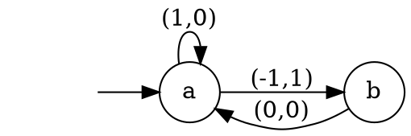

# Homework 3

_Instructions_
* Due on November 13.
* Send your solution by email o Simin Oraee.
* You can work in groups up to 3 people, be sure to include the names of all the participants.
* You can submit your solution in pdf or text format and any other srouce file.
  If you have more than one file place all your files in a single archive (zip or tar.gz).


## Petri Net, Termination, and Linear Programming

We saw that for co-linear properties it is possible to have sound but incomplete analysis of Petri nets using linear porgramming.
Co-linear properties are a form of reachability properties.
We will try to generalize this and encode termination as a linear program.

In the [lecture notes 3.md](viewer.html?md=concurrency_theory_2018/notes_3.md), we saw that a Petri net does not terminate if there is a non-decreasing cycle, i.e., a sequence of transition which produces a marking greater or equal when it fires.

_Task 1._
- Explain how to encode the presence of non-decreasing cycles as a linear constraints problem.
- Show your encoding on the following net:
  ```graphviz
  digraph PN{
    rankdir=LR
    ranksep=0.75;
    node [shape = circle, fixedsize = true, width = 0.5, fontsize = 15];
    c [label=" " ];
    d [label="∙" ];
    m [label="∙" ];
    node [shape = box, label = "", style = filled, fillcolor = black, fixedsize = true, width = 0.15, fontsize=15]; 
    c -> t3;
    t3 -> d [xlabel = "2"];
    m -> t5;
    t5 -> c;
    t6 -> m [dir=both,arrowhead=none,arrowtail=normal];
    edge [style = invis];
    c -> t4;
    t4 -> d;
    edge [style = default, constraint = false];
    d -> t4 [xlabel = "3"];
    t4 -> c [xlabel = "2"];
  }
  ```

_Task 2._
- Does this analysis always work? _hint:_ Can you give and example that terminates but where the linear programs cannot show it?
- Is your analysis sound? (yes/no) is it complete? (yes/no)
- Does that change if you can pick the initial state?


## Vector Addition System with States

Vector addition system with states (VASS) are extensions of states machines with counters.

A VASS $V$ is a 4-tuple $(Q, n, δ, i₀)$ where
* $Q$ is a finite set of states
* $n$ is the dimension of the VASS (number of counters)
* $δ$ is the transition relation ($Q × ℤ^n × Q$)
* $i₀$ is the initial state and value of the counters ($i₀ ∈ Q×ℕ^n$)

A transition $(q,v,q')$ can be applied to a state $(x,y)$ if $x=q$ and $v+y ≥ 0$.
It results in the new state $(q',v+y)$.
We write the transition $(q,y)→(q',v+y)$.

_Example._
Consider the following 2 dimensional VASS

and the initial state $(a, (0,1))$:
- the transition to $b$ is not possible as $(0,1) + (-1,0) = (-1,1)$ which is not $≥ 0$.
- the loop to $a$ can be taken and gives a new state $(a, (1,1))$

_Task 1._
Our goal is to show that VASS have the same expressive power as Petri nets.
* Explain how to encode a Petri net into a VASS
* Explain how to encode a VASS into a Petri net

_Task 2._
Prove that your constructions are correct.
We need to show that a state/marking is reachable in one model iff it is reachable in the other.

Let $N = (S,T,W,M₀)$ be a Petri net and $V = (Q,n,δ,i₀)$ a VASS.

- Assume $V$ is obtained from $N$ by your construction.
  Give a mapping $m$ from the marking of $N$ to the states of $V$ such that $∀ M'. M₀[〉^\*M' ⇔ m(M) →^* m(M')$ where $[〉^\*$ and $→^*$ are the reflexive and transitive closure of the firing and transition relations.
  Prove your $m$ indeed satisfy the condition.
- Same but for the VASS to Petri net direction.
  As the constructions are different, $m$ can be different.
