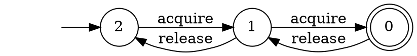

# Solutions 1

## Correctness of the Determinization Construction

We need to show that $w ∈ L(D) ⇒ w ∈ L(N)$.

* Let $t_D = r^D_0 a_1 r^D_1 a_2 … a_n r^D_n$ be an accepting trace of $D$ for $w$.
  $t_D$ exists by definition of $L(N)$ and the assumption that $w ∈ L(D)$.
* We are goint to show that for all $i≥0$ and all $q ∈ r_{Di}$, there exists a trace of $N$ where $r^N_i = q$.
  By induction on $t_D$:
  - base case:
    + $r^D_0 = \\{ q_0^N \\}$ and $r^N_0 = q^N_0$ by definition
  - step $r^D_i a_{i+i} r^D_{i+1}$:
    + by definition of $t_D$ and $δ_D$: $r_{i+1}^D = δ_D(r_i^D, a_i) = \bigcup_{q∈q^D_i} δ_N(q, a_i)$
    + therefore, for any $q' ∈ r_{i+1}^D$ we can find $q ∈ r_i^D$ such that $r_{i+1}^N ∈ δ_N(q, a_i)$
    + by induction hypothesis for all $q$ in $r^D_i$ we have a trace of $N$ where $r^N_i = q$
* By hypothesis, the last state of $t_D$ is $q_n^D$ with $q_n^D ∩ F_N ≠ ∅$.
* By the above, we can find a trace $t_N$ with the last state in $q_n^D ∩ F_N$ ($⊆ F_N$).
* Therefore, $t_N$ is accepting.

## Encoding Programs as Automaton

__task 1.__

The basic idea behind the semaphore encoding is (here for $n=2$):


It is possible to encode a semaphore with any fixed maximal number of permission using a DFA.

__task 2.__

Making the lock reentrant is not possible with a DFA.
It requires a pushdown automaton.

First, we need to modify the alphabet distinguish between processes.
Only the process that has the lock can lock again.
We can do that by having `lock_i` and `unlock_i` where `i` is an unique process id.

First the automaton starts in default accepting state and an empty stack.
When the stack is empty any process can `lock` and the process id is pushed on the stack.
A process can re`lock` if its id is on top of the stack and the id is again pushed on the stack.
A process can `unlock` if its id is on top of the stack and the stack gets popped.
Any other transition lead to a sink error state.


## Longest (Worst Case) Shortest Counterexample to a Safety Property for Automata

#### Simple version: general DFA

First, we will look at the case where the program and the property are arbitrary DFA.

1. In the worst case, the shortest word in the product DFAs of size $m$ and $n$ is $m * n - 1$.

2. Consider an alphabet with a single letter $Σ = \\{ a \\}$.
   We can use a DFA with $n$ states to count modulo $n$.

   For instance here is a DFA what accepts the word of size $w$ where $(|w| \mod 3) = 2$:
    ```graphviz
    digraph finite_state_machine {
        rankdir=LR;
        node [shape = circle];
        init [shape = none, label = ""];
        C [shape = doublecircle];
        init -> A;
        A -> B [ label = "1" ];
        B -> C [ label = "1" ];
        C -> A [ label = "1" ];
    }
    ```

    Take the product of two automaton build in a similar fashion $(|w| \mod m) = m-1$ and $(|w| \mod n) = n-1$ where $m$ and $n$ are different prime numbers.
    The first accepted word has size $m * n - 1$.

3. The family of examples we have seen above shows that the bound is at least $m * n - 1$.
   We now need to show that the bound is tight.

   __claim 1.__ The short word accepted by an automaton does not visit twice the same state.
   (Otherwise, we can just remove the part of the word between that goes from a state and get back to the same state.)

   __claim 2.__ In a graph, an acyclic path of size $s$ visit $s+1$ nodes.
   (start node and then one node per edge in the path.)

   By the two claims, we have that a word of size $m * n - 1$ visit at most $m * n$ different states (every state in the product of the two automaton).
   Any word longer than that will necessarily visit one state twice and, therefore, it cannot be the shortest accepted word.

4. Since the product is exponential in the number of automaton, having more programs in parallel leads to exploring exponentially longer executions to find bugs.
   This is known as the state-space explosion problem and make testing concurrent program (in the worst case) challenging.

#### More precise version: prefix-closed DFA

If we look in more details, the automaton that we have seen in the class to express program and safety properties are prefix-closed.
All their states except one are accepting and the non-accepting state is a sink state (once this state is reached, it is not possible to get to an accepting state again).

When we take the negation of the safety properties we get the opposite, all the state but one are non-accepting and when we get to the accepting state, every suffix of the trace is also accepted.

With such automaton it is not possible to have such bad bound.
However, the length is still in $ \mathcal{O}(m * n) $.
More precisely, the length is $(m-1) * (n-1)$.

We cannot visit the sink state of the program, so we can only visit $m-1$ different states from that automaton.
From the automaton representing the property, we first exhaust the $n-1$ non-accepting state and then get to the accepting state.

The trace first visits all the pairs of states which are accepting in the program and non-accepting in the properties: $(m-1) * (n-1)$ different states which means the corresponding word has size $(m-1) * (n-1) - 1$.
Then we have a transition which reach a pair of states accepting in both automaton.
This brings the trace to length $(m-1) * (n-1)$.
