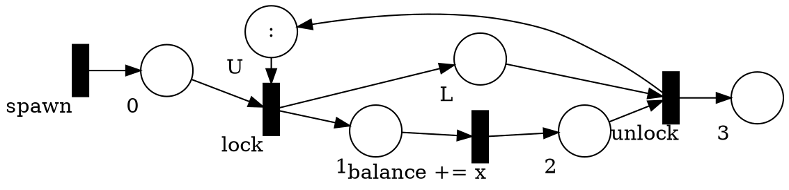
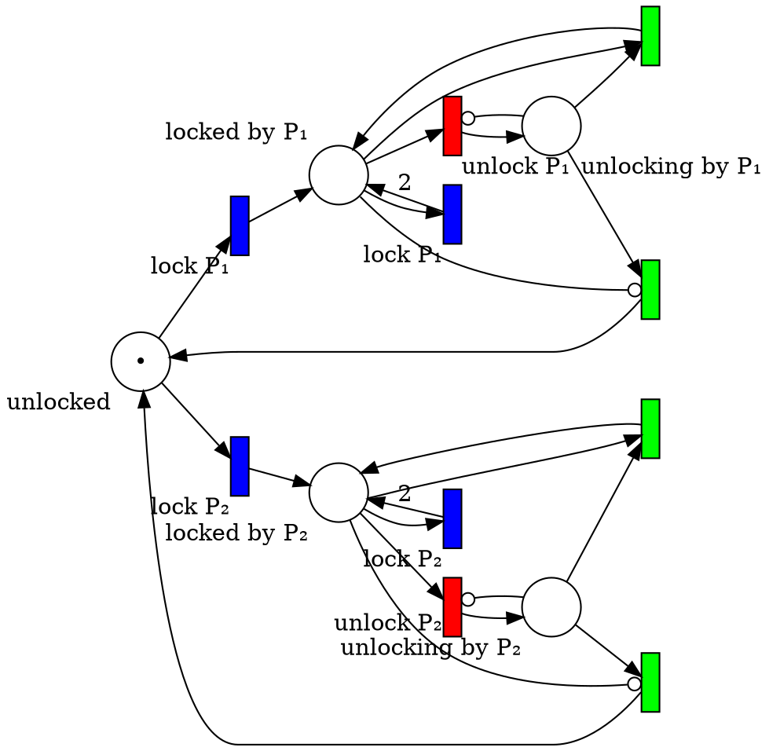

# Solutions 2

## Synchronized Product for DFAs/NFAs with Different Alphabets

#### Task 1

$T$ extends the automaton with self-loops that do not change the state for the new element in the alphabet:

$T((Q_M,Σ_M,δ_M,q_{0M},F_M),\Sigma) = (Q_M,\Sigma,\delta,q_{0 M},F_M)$ where

$∀ a ∈ Σ.\ (a ∈ Σ_M ⇒ δ(q, a) = δ_M(q, a)) ∧ (a ∉ Σ_M ⇒ δ(q, a) = q)$

By inlining the definition of $T$ in the simple product we get:
* $a ∈ Σ_P ∧ a ∈ Σ_Q ⇒ δ((q_P,q_Q), a) = (δ_P(q_P, a), δ_Q(q_Q, a)) $
* $a ∉ Σ_P ∧ a ∈ Σ_Q ⇒ δ((q_P,q_Q), a) = (q_P, δ_Q(q_Q, a)) $
* $a ∈ Σ_P ∧ a ∉ Σ_Q ⇒ δ((q_P,q_Q), a) = (δ_P(q_P, a), q_Q) $
* $a ∉ Σ_P ∧ a ∉ Σ_Q ⇒ δ((q_P,q_Q), a) = (q_P, q_Q) $

Because $a ∈ Σ_P ∪ Σ_Q$, the last case never happens and this corresponds to the definition of the synchronized product.

#### Task 2

Generalizing the synchronized product to NFA gives  $M_1 ⊗_{NFA} M_2 = M$ where

* $Q = Q_1 × Q_2$
* $Σ = Σ_1 ∪ Σ_2$
* $δ$ is the transition function
  - $δ((q_1,q_2), a) = \\{ (q_1',q_2') ~|~ q_1' ∈ δ_1(q_1, a) ∧ q_2' ∈  δ_2(q_2, a) \\}$ if $a ∈ Σ_1$ and $a ∈ Σ_2$
  - $δ((q_1,q_2), a) = \\{ (q_1,q_2') ~|~ q_2' ∈  δ_2(q_2, a) \\}$ if $a ∉ Σ_1$ and $a ∈ Σ_2$
  - $δ((q_1,q_2), a) = \\{ (q_1',q_2) ~|~ q_1' ∈ δ_1(q_1, a) \\}$ if $a ∈ Σ_1$ and $a ∉ Σ_2$
* $q₀ = (q₀_1, q₀_2)$
* $F = F_1 × F_2$

The proof of correctness uses the same principle as the determinization.
However, instead of keeping track of set of states, we have to keep track of pairs of set of states and sets of pairs of states.

## Petri nets

#### Task 1

The modification is quite straightforward: just add 1 more token in the place $U$ in the initial marking.
  

To show that the number of permit is preserved, we can use a structural invariant.

With the ordering on the places be $(U, L, 0, 1, 2, 3)$, and the ordering on transitions $(\mathit{lock}, \mathit{balance += x}, \mathit{unlock}, \mathit{spawn})$, the connectivity matrix is

$C =
\begin{bmatrix}
-1 &  0 &  1 & 0 \\\\
 1 &  0 & -1 & 0 \\\\
-1 &  0 &  0 & 1 \\\\
 1 & -1 &  0 & 0 \\\\
 0 &  1 & -1 & 0 \\\\
 0 &  0 &  1 & 0
\end{bmatrix}$

$I^T = \begin{bmatrix}1 & 1 & 0 & 0 & 0\end{bmatrix}$ is a structural invariant and we have that $I^T\cdot M₀ = 2$ (2 permits initially).

#### Task 2

There are more than one way to do that.
Here is one solution.
The challenge is that only the process which has the lock is allowed to relock it.
Therefore, we need to be able to distinguish between different processes.
To do that, we need to introduce as many lock/unlock transitions as there are processes.

Here is the example with two processes:

The colors mean:
* blue: transition for locking
* red: transition for unlocking
* green: internal transition for unlocking

For each process there is two lock transitions depending on whether the process already has the lock or not.

The unlock is a bit more complex.
First it consumes a "locked" token and goes to an intermediate place.
There can be at most one unlock at the time (enforced by an inhibitory edge).
From the intermediate place, depending whether there are more locked token a token may be put back in the unlocked place.
