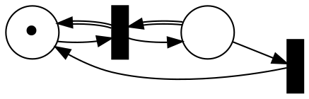
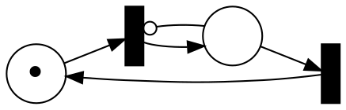

# Solutions 4

Thanks to Oliver Markgraf, Hannes Endres, Alexander Witton, Billy Joe Franks, Kerem Kahraman, and Pascal Bergsträßer for contributing to this solution.

## Boundedness for transfer and reset nets

#### Task 1

Consider the following counter example for transfer nets:


For $M = (1,0)$ and $M^\prime = (1,1)$ we have $M < M'$ and $M [t_1 t_2 \rangle M'$, but

$
M [(t_1 t_2)^2 \rangle (2,1) \neq (1,2) = M + 2 \cdot  (M' - M)
$.

Similarly, we obtain the following counter example for reset nets:


For $M = (1,0)$ and $M^\prime = (1,1)$ we have $M < M'$ and $M [t_1 t_2 \rangle M'$, but

$
M [(t_1 t_2)^2 \rangle (1,1) \neq (1,2) = M + 2 \cdot  (M' - M)
$.


#### Task 2

* The boundedness check is still valid for transfer nets.
  Transfer net are still strictly monotonic.
  But it still works using a weaker argument.
  Let $M < M'$ such that $M [π^i〉M'$ then $|M'| = |M| + i⋅|M'-M|$.
* The boundedness check for reset nets is not correct anymore.
  Reset net are not strictly monotonic.
  In the example for reset nets above we reach a marking $M'$ from a marking $M$ such that $M < M'$.
  Thus, our algorithm would return ``unbounded'', but further repetitions of $t_1 t_2$ always result in the marking (1,1) and therefore this sequence does not lead to an unbounded number of tokens. 

## Modified KM tree for Petri nets

#### Task 1

The algorithm does not terminate as soon as it accelerates.

Consider the net:

```graphviz
digraph PN {
	rankdir=LR;
    node [shape = circle, fixedsize = true, width = 0.5];
    p1 [ label=""];
    node [shape = box, label = "", style = filled, fillcolor = black, fixedsize = true, width = 0.15];  t1;
    t1 -> p1;
}
```


The tree starts with:
```
(0)
```
Then
```
(0) → (1)
```
Then
```
(0) → (ω)
```
Then we get stuck in an infinite loop.
`(0)` is a strictly smaller ancesstor of `(ω)`.
Therefore, we apply acceleration again without any effect and put `(ω)` back in `F`.


#### Task 2

__1.__
Termination: The algorithm terminates, because of 2 reasons:
* There is no infinite decreasing transition sequence, because at some point we have no more markings and cannot fire any transition.
  This ensures that we won’t add infinitely many edges and markings to our tree, meaning the last else branch in the algorithm only occurs finitely often.
* If we find and ancestor that is smaller, we can accelerate the place.
  This means we can at most accelerate $|S|$ times which means the second else branch of the algorithm occurs finitely often in every computation.

The first condition of the if-else branches never adds something to the frontiers `F` which means it does not add additional iterations in our while loop.
Finally, in every iteration of the while loop, we remove one element from `F` and only add finitely many elements to `F`.
Thus, the algorithm terminates.

__2.__
The $\Rightarrow$ direction should be mostly clear, because the algorithm only extends the transitions that are enabled from $M₀$.
 Furthermore, we already showed in the lecture that if we can accelerate a marking, then $(S,T,W,M₀)$ can still cover the marking.

__3.__
Let a marking $M$ that is not covered by `KarpMillerTree2` be given.
This means there is a place $i$ such that we never accelerated $M(i)$ and we also did not reach $M(i)$ by extending our tree with the transitions enabled from our markings.
The algorithm extends the tree whenever the frontier has only incomparable ancestors and accelerates if there is on ancestor that is strictly smaller than the frontier.
More precisely, the algorithm accelerates over all possible ancestors since we remove an ancestor once we used it.
We do not remove any unused ancestors, because if there was such an unused ancestor, then it can be either used before or the acceleration has the same result.
We also do not reach $M(i)$ by extending our tree, therefore we always end each branch of the tree once we find that there exists an ancestor such that $A = M$.
But this means that we are in a transition "cycle" which means we have exhausted the transitions that result in bigger or incomparable markings.
Thus, $(S,T,W,M₀)$ can never reach the marking $M(i)$.
