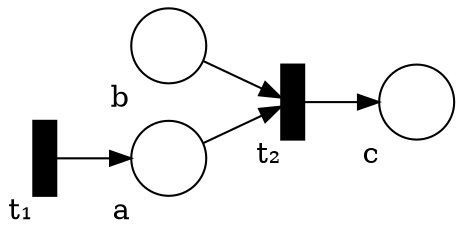
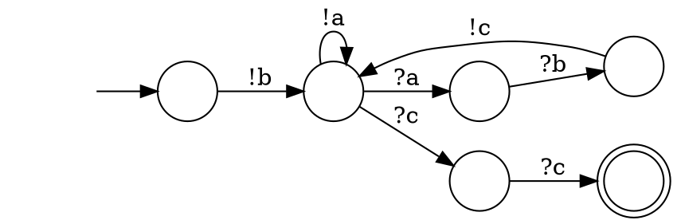

# Solutions 7

## Bounded CSM State Space Size

A state of the CSM consists of the internal states of each state machines and the contents of the channel between each pair of state machines.

Each channel has $\mathcal{O}(|\Sigma|^k)$ different configuration and there are $N²$ channels.
The total number of states for the channels is therefore in $\mathcal{O}(|\Sigma|^{kN²})$.

Then we have the local state of all the machines: $\mathcal{O}(m^N)$.

Therefore, the over state space is in $\mathcal{O}(|\Sigma|^{kN²}m^N)$.

## Communicating State Machines with Bags (instead of FIFO)

### CSM to PN

* Places:
  - For each bag we have $|\Sigma|$ places.
    The total number of places of this type: $N |\Sigma|$
  - For each state we have one place.
    The total number of places of this type: $N m$
* Transitions:
  - For each send we take one token from the corresponding internal state and we add one token to the other internal state of sender and also one token to the corresponding bag (receiver and message).
    The total number of transition of this type is $\mathcal{O}(m^2 N |\Sigma|)$.
  - For each receive we take one token from the internal state and one from the corresponding message bag and add one token to the other internal state.
    The total number of transition of this type is $\mathcal{O}(m^2 N |\Sigma|)$.
* Initial state:
  - In the initial marking we add token to each initial states of each machine.
* Control-state reachability:
  - To check the control-state reachability we just need to check the corresponding is coverable or not.

### PN to CSM

Without loss of generality we assume that CSM is able to send itself messages.

* Channel alphabet:
  - For each place in the Petri net, we have one letter in the alphabet.
* Local states and transitions:
  - The state machine is roughly a scheduler which non-deterministially decide to executes a transition or to check whether the target marking is covered.
  - When the machine decides to execute a transition, it serializes the operations (requiring extra local states).
    First, for each token consummed the machine receives the corresponding message.
    Then, for each token produced, the machine sends the corresponding message.
  - When the machine thinks it have reached the marking we want to cover, it executes a sequence to receives with one receive for each token in the marking.
    The local state at the end of this receive sequence is the state to use in the control-state reachability check.
  - For fill the initial marking, the machine executes the appropriate sequence of send and then get into the state where it choose to schedule transitions.

#### Example

Consider the following Petri net:

If the initial marking is $(a: 0, b: 1, c: 0)$ and the target marking is $(a: 0, b: 0, c: 2)$, we get the following CSM:
    

## Lossy Channel Systems with Test for Empty Channel

We have seen that Lossy channel systems are WSTS, therefore we just need to check whether the ordering is still compatible with the new rule.

While "test for empty" may sound similar to a test for $0$ on counter, it is actually not that bad.
For the intuition, you can think of test for empty channel as a reset edge in PN.

We use the same ordering we use to proved that LCS are WSTS.
Therefore the ordering is subsequence ordering over the content of the channel.
It is WQO with the same argument that we had there.

To show compatibility suppose $x_1 → x_2$ and $x_1 ≤ y_1$, if the content of the channel in $y_1$ is not empty we need to first (repeatedly) apply the rule that drops a message until the channel for the process taking a step are empty. Then we can apply the same rule there to get $y_2$.
