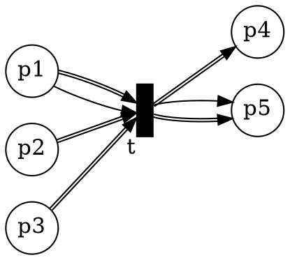
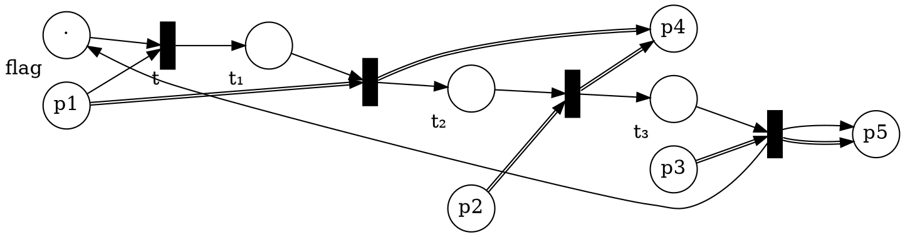

# Solutions 9

Thanks to Oliver Markgraf, Hannes Endres, Alexander Witton, Billy Joe Franks, Kerem Kahraman, and Pascal Bergsträßer for contributing to this solution.

## Weak Bisimulation

We use the rules of structural congruence and strong ground equivalence (SGE) to show the bisimulation property:

$
\begin{array}{cl}
&(\nu c) (?a.!c.0\mid?b.!c.0\mid?c.?c.P)\\\\
\overset{\text{SGE}}\equiv &(\nu c)( ?a.(!c.0\mid?b.!c.0\mid?c.?c.P) + ?b.(?a.!c.0\mid!c.0\mid?c.?c.P)) + 0 \\\\
\overset{\text{SGE}}\equiv &(\nu c)(?a.?b.(!c.0\mid!c.0\mid?c.?c.P)+ ?a.\tau.(0\mid?b.!c.0\mid?c.P) \\\\
&+ ?b.?a.(!c.0\mid!c.0\mid?c.?c.P) + ?b.\tau.(?a.!c.0\mid0\mid?c.P))\\\\
\overset{\text{SGE*}}\equiv &(\nu c)(?a.?b.\tau.\tau.P+ ?a.\tau.?b.\tau.P \\\\
&+ ?b.?a.\tau.\tau.P + ?b.\tau.?a.\tau.P) \\\\
\overset{\text{weak sim}}\approx &(\nu c)(?a.?b.P+ ?a.?b.P + ?b.?a.P + ?b.?a.P )\\\\
\overset{c \not \in fn}\equiv & ?a.?b.P+ ?a.?b.P + ?b.?a.P + ?b.?a.P \\\\
\equiv &  ?a.?b.P + ?b.?a.P
\end{array}
$


## From ν-free Process Algebra to Petri Net

Let $(\nu \vec{a}) \prod_i A_i(\vec{a_i})$ with $\vec{a_i} \subseteq \vec{a}$ be an initial process in $\nu$-free calculus, i.e. no process definition contains restrictions and $\vec{a}$ contains all possible names.

W.l.o.g. we assume that every process definition has one of the following forms:
* $P(\vec{p}) \stackrel{\text{def}}{=} !p(\vec{p_1}).Q(\vec{p_2})$
* $P(\vec{p}) \stackrel{\text{def}}{=} ?p(\vec{x}).Q(\vec{p_1},\vec{x_1})$
* $P(\vec{p}) \stackrel{\text{def}}{=} Q_1(\vec{p_1}) + Q_2(\vec{p_2})$
* $P(\vec{p}) \stackrel{\text{def}}{=} Q_1(\vec{p_1}) \mid Q_2(\vec{p_2})$
* $P(\vec{p}) \stackrel{\text{def}}{=} 0$

where $p \in \vec{p}$ and $\vec{p_1},\vec{p_2} \subseteq \vec{p}$ and $\vec{x_1} \subseteq \vec{x}$. So, every process definition contains only one action or control flow element.

#### Task 1

We construct the corresponding Petri net $N = (S, T, W, M_0)$ as follows:

_step 1: places._

Like in the direct proof of WSTS, we first get all the names and definitions and use them to create the places.

$S = \\{P(\vec{b}) \mid P \text{ process definition}, \vec{b} \subseteq \vec{a} \text{ of suitable length}\\}$

_step 2: transitions._

For the transitions we iterate over all places and pairs of places to check if they have a (joint) transition.

Then create the following transitions:
* if $P(\vec{b}) = !a(\vec{b_1}).Q(\vec{b_2})$ and $P^\prime(\vec{b^\prime}) = ?a(\vec{x}).Q^\prime(\vec y)$ with $Q'(\vec b_2) = Q'(\vec y)[\vec{b_1}/\vec{x}]$: 
    ```graphviz
    digraph PN{
      rankdir=LR
      ranksep=0.75;
      node [shape = circle, fixedsize = true, width = 0.5, fontsize = 15, label = ""];
      p1 [xlabel="P(b)" ];
      p2 [xlabel="P′(b′)" ];
      q1 [xlabel="Q(b₂)" ];
      q2 [xlabel="Q′(b₂′)" ];
      node [shape = box, label = "", style = filled, fillcolor = black, fixedsize = true, width = 0.15, fontsize=15];  
      t1;
      p1 -> t1;
      t1 -> q1;
      p2 -> t1;
      t1 -> q2;
    }
    ```
* if $P(\vec{b}) = Q_1(\vec{b_1}) + Q_2(\vec{b_2})$:
    ```graphviz
    digraph PN{
      rankdir=LR
      ranksep=0.75;
      node [shape = circle, fixedsize = true, width = 0.5, fontsize = 15, label = ""];
      p1 [xlabel="P(b)" ];
      q1 [xlabel="Q(b₁)" ];
      q2 [xlabel="Q(b₂)" ];
      node [shape = box, label = "", style = filled, fillcolor = black, fixedsize = true, width = 0.15, fontsize=15];  
      t1; t2;
      p1 -> t1;
      p1 -> t2;
      t1 -> q1;
      t2 -> q2;
    }
    ```
* if $P(\vec{b}) = Q_1(\vec{b_1}) \mid Q_2(\vec{b_2})$:
    ```graphviz
    digraph PN{
      rankdir=LR
      ranksep=0.75;
      node [shape = circle, fixedsize = true, width = 0.5, fontsize = 15, label = ""];
      p1 [xlabel="P(b)" ];
      q1 [xlabel="Q(b₁)" ];
      q2 [xlabel="Q(b₂)" ];
      node [shape = box, label = "", style = filled, fillcolor = black, fixedsize = true, width = 0.15, fontsize=15];  
      t1;
      p1 -> t1;
      t1 -> q1;
      t1 -> q2;
    }
    ```
* if $P(\vec{b}) = 0$:
    ```graphviz
    digraph PN{
      rankdir=LR
      ranksep=0.75;
      node [shape = circle, fixedsize = true, width = 0.5, fontsize = 15, label = ""];
      p1 [xlabel="P(b)" ];
      node [shape = box, label = "", style = filled, fillcolor = black, fixedsize = true, width = 0.15, fontsize=15];  
      t1;
      p1 -> t1;
    }
    ```

_step 3: initial state._

We set the initial marking $M_0$ such that for each $P(\vec{b}) \in S$ it holds that $M_0(P(\vec{b}))$ is the number of occurrences of $P(\vec{b})$ in the initial process $(\nu \vec{a}) \prod_i A_i(\vec{a_i})$.


#### Task 2

This is roughly similar to the previous case.
However, the broadcasts transfer the whole content of a place rather than move tokens one at the time.

We will proceed as follow
1. introduce a more general class of tranfer nets: [multi-transfer nets](https://hal.archives-ouvertes.fr/hal-00158709/document).
2. reduce the ν-free broadcasts to multi-transfer nets
3. reduce multi-transfer nets to transfer nets

_Step 1._
Multi transfer nets are transfer net with more than one transfer edge:

An _Multi-Transfer Net_ $N$ is a 4-tuple $(S, T, W, R)$ where
* $S$ is a finite set of places
* $T$ is a finite set of transitions
* $W$ is a weight function over $(S × T) ∪ (T × S) → ℕ$
* $R$ is a transfer function over $T → (2^S×S)^\*$ which maps a transition to pairs of source places and target.

Furthermore, $R$ respects the following conditions:
* $R(t) = ((S_1,t_1), (S_2, t_2), …)$ then $∀ i.\ t_i ∉ S_i$. (target and sources are different)
* $R(t) = ((S_1,t_1), (S_2, t_2), …)$ then $∀ i j.\ i≠j ⇒ (S_i ∪ \\{t_i\\}) ∩ (S_j ∪ \\{t_j\\}) = ∅$. (transfers are disjoint)

$t$ is enabled at $M$ iff $∀ s ∈ S.\ M(s) ≥ W(s,t)$.
This is similar to Petri nets.

$M [t〉 M'$ is computed as follow:
1. $t$ must be enabled at $M$
2. create an intermediate marking $M₁$ where $M₁(s) = M(s) - W(s,t)$.
3. assume $R(t) = ((S₁,t₁), …)$ create an intermediate marking $M₂$ to apply the transfer:
  * if $∃ i.\ s ∈ S_i$ then $M₂(s) = 0$
  * if $∃ i.\ s = t_i$ then $M₂(s) = M₁(s) + ∑_{x∈S_i} M₁(x)$
  * otherwise $M₂(s) = M₁(s)$
4. compute the final marking: $M'(s) = M₂(s) + W(t,s)$.

_Step 2._

Only the send/receive transition changes.
The remaining transition are the same.

* Let $P(\vec{x}) = !a(\vec{x_1}).P'(\vec{x_2})$.
* Let $t_i$ be $Q_i'(\vec y_2)$ and $S_i = \\{ Q_i(\vec{y_i}) ~|~ Q_i(\vec{y_i}) = ?a(\vec{y}).Q_i'(\vec z) ∧ Q_i'(\vec y_2) = Q'(\vec z)[\vec{x_1}/\vec{y}] \\}$.

We create a transition $t$ where
* $W(P(\vec{x}), t) = 1$
* $W(t, P'(\vec{x_2})) = 1$
* $R(t) = ((S_i,t_i))$ as defined above where $S_i ≠ ∅$

_Step 3._

To reduce multi-transfer nets to transfer net we need to create some gadget that serialize the transfer.
We add an extra place, initially with 1 token, which serve as flag whether a transition is being processed or we are ready to fire the next transition.

When a transition fires, we consume the flag token, execute all the transfer one at the time, and finally put the flag token back.

Here is an example with
* $W(p1, t) = 1$, $W(t, p5) = 1$, otherwise $W$ is $0$
* $R(t) = ((\\{p1, p2\\},p4), (\\{p3\\},p5))$

We get the transfer net:


## Making a Model from Code

#### Choice of the Model

CSM are not suitable because we potentially have an unlimited number of actors/clients.
CSM have a fixed number of processes and we need to model process creation.

CCS can model process creation but it cannot model mobility (sending names as part of messages).
In this example, the client sends its own address as part of the request.

The π-calculus easily allows both process creation and mobility.

#### What it modeled/left out

* _About names._
  In the actor model, each process get an unique address at its creation and this cannot be changed.
  `self()` always return the same address.
  Therefore, we use $ν$ when the process gets created and the definition for actors always carries the self.
* _About different kinds of messages._
  In this example, each actor receives only one type of message (`request` for the server, `hit_count` for the client).
  Therefore, we had one name per actor.
  However, if we want to model more type of messages, we can have multiple name per processes.
  For each process, we always carries these names around in the same order and associate one type of message to each name.
* _Asynchronous message-passing._
  The actor model use asynchronous message-passing.
  Therefore, we model sending messages as creating a new process which carries the message.
* _About side effect._
  While we could model printing by creating a "stdout" process and sending message to that processm, we decided to ignore the printing and replace it by $τ$.
* _Closed world._
  In this case, the program is closed-world.
  Therefore, $\text{Main}$ does not have any name as arguement.

#### Model

With an "extension" of the calculus with integers values:

$
\begin{array}{lcl}
Server(self: name, state: int) & ≝ & ?self(return).(!return(state+1).0 | Server(self, state+1)) \\\\
Client(self: name, server: name) & ≝ & !server(self).0 | ?self(count).τ.0 \\\\
Main() & ≝ & (ν s) (Server(s, 0) | (ν c) Client(c, s))
\end{array}
$

Since CCS/π-calculus can model counters (see Turing complteness of the CCS), this is more syntactic sugar than an actual extension.
The numbers and operation can be replace by their equivalent in the process algebra.
