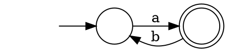

# Lossy Channel System (LCS)

LCS are just another name for CSM with unbounded p2p lossy FIFO channels.

## Embedding on Words

Let us recall some results seen in [notes 4](notes_4.md).

Let $w₁$ and $w₂$ be two finite sequences/words.
$w₁$ is a _subsequence_ of $w₂$ if it is possible to obtain $w₁$ from by deleting some characters of $w₂$.
More formally, there is an injective mapping $f$ from $[0, |w₁|)$ to $[0, |w₂|)$ such that:
* $∀ i j.\ i < j ⇒ f(i) < f(j)$
* $∀ i.\ w₁[i] = w₂[f(i)]$

For instance:
* $0110$ is a subsequence of $01010101$ with the following mapping: $(0→0)$, $(1→1)$, $(2→3)$, $(3→6)$.
* $0110$ is not a subsequence of $10100$.

We can generalize the subsequence relation to _embedding_ by relaxing the second condition to $≤$ instead of $=$.
However, since we will apply the embedding on channels with a finite number of different messages, $=$ will be sufficient.

__Higman's lemma.__
The embedding relation over finite sequences of well-quasi-ordered elements $(X,≤)$ is a WQO.

Before we can prove the lemma, we need some extra definitions and lemmas.
The proof is adapted from [these notes by Ian Hodkinson](http://www.doc.ic.ac.uk/~imh/papers/bar.pdf).

Given a quasiorder $(X,≤)$, a _bad sequence_ is an infinite sequence $x₀ ~ x₁ …$ such that $∀ i j.~ i < j ⇒ x_i ≰ x_j$.
A WQO is a quasiorder without bad sequence.

A sequence $x₀ ~ x₁ ~ …$  is _minimal bad_ iff it is bad and for any $i$ there is no bad sequence $x₀ ~ x₁ ~ … ~ x_{i-1} ~ y_i ~ y_{i+1} …$ with $y_i < x_i$.
For all prefix of the sequence, it is not possible to extend the sequence to a bad sequence with a smaller element.

__Proposition.__
If $(X,≤)$ is a quasiorder with $<$ well-founded but not a WQO then it contains a minimal bad sequence.

_Proof._
* Let us construct a minimal bad sequence.
* base case:
  - Pick $x₀$ a minimal element which extends to a bad sequence.
    Such element must exists because because $(X,≤)$ is not a WQO (it contains bad sequences) and since $<$ is well-founded any set has a minimal element.
    $x₀$ is a minimum in the set of elements starting a bad sequence.
* inductions step: we have a prefix $x₀…x_{n-1}$
  - Chose $x_n$ to be a minimal element among the set of elements such that $x₀…x_n$ extends to a bad sequence.
  Such element exsits by the same reasoning as above.

__Proposition.__
Let $(X,≤)$ be a quasiorder with $<$ well-founded and $x₀ ~ x₁ …$ be a minimal bad sequence.
Define the set $Y = \\{ x ∈ X ~|~ ∃ i. x < x_i \\}$.
$(Y,≤)$ is a WQO.

_Proof._
* By contradiction: assume $(Y,≤)$ is not a WQO.
* Let $y₀ ~ y₁ … $ be a bad sequence in $Y$.
* Let $i$ be the minimal $i$ such that $∃ j.~ y_j < x_i$.
* The sequence $x₀ … x_{i-1} ~ y_j ~ y_{j+1} … $ is bad:
  - The $x$ prefix comes from a bad sequence so it cannot contains increasing elements.
  - The $y$ suffix comes from a bad sequence so it cannot contains increasing elements.
  - We are left with comparing element from accross $x$ and $y$:
    * By contradiction to the badness: assume $x_m ≤ y_n$ for some $m < i$ and $n ≥ j$.
    * By definition of $Y$ we have $y_n < x_{i'}$ and by minimality of $i$ we have $i ≤ i'$.
    * So we have $x_m ≤ y_n < x_{i'}$ and $m < i ≤ i'$, contradicting the badness of $x₀ ~ x₁ …$
* $x₀ … x_{i-1} ~ y_j ~ y_{j+1} … $ contradicts the minimality of $x₀ ~ x₁ …$

__Proposition.__
Strict embedding is a well-founded relation over finite words from a WQO letters.

_Proof Sketch._
To make a infinite descending chain, we must makes (1) some letter in the word smaller or (2) make the word shorter.
(1) can only be done finitely often because the letter are WQO.
(2) can only be done finitely often until we get the empty word.

_Proof of Higman's lemma._
1. Embedding is a quasiorder:
  * Embedding is reflexive: use identity as $f$ in the definition of embedding.
  * Embedding is transitive: let $x ≤ y ≤ z$ and $f$ and $f'$ the mapping in $x ≤ y$ and $y ≤ z$, $f'∘f$ define an embedding for $x ≤ z$.
2. Embedding does not contains bad sequences:
  * By contradiction: assume $x₀~x₁…$ is a minimal bad sequence.
    * All the words in the sequence are non-empty because the empty word is smaller than any word and it cannot appear in a bad sequence.
    * For each word $x_i$, we split the head ($x_i[0]$) and tail ($x_i[1:|x_i|]$) of the word.
    * Let $Y = \\{ tail(x₀), tail(x₁), … \\}$. Y is a WQO because of $tail(x_i) < x_i$ and the proposition above.
    * Because $Y$ is WQO, $Y$ contains a infinite increasing sequence $tail(x_{f(0)}) ≤ tail(x_{f(1)}) ≤ …$
    * Because $(X,≤)$ is a WQO the sequence $head(x_{f(0)}) ~ head(x_{f(1)}) …$ contains $i<j$ with $head(x_{f(i)}) ≤ head(x_{f(j)})$.
    * Therefore, $x_{f(i)} ≤ x_{f(j)}$ by mapping the mapping the first element of $x_{f(i)}$ to the first of $x_{f(j)}$ and using the mapping from $tail(x_{f(i)}) ≤ tail(x_{f(j)})$ for the rest.
    * This contradicts the badness of $x₀~x₁…$

__Corollary.__
Given a finite alphabet $Σ$, the subsequence ordering is a WQO.

_Proof._
$(Σ,=)$ is a WQO and applying Higman's lemma give the WQO $(Σ^\*,≤)$.

## LCS are WSTS

The subsequence will form the basis of the WQO for LCS.

__Proposition.__
Let $i$ be a process in a LCS with the word $w₁$ as the content of an incoming channel and let $w₂$ be a word such that $w₁ ≤ w₂$.
Form a state where the content of a channel is $w₂$ it is possible to apply the transition rule for losing message to get to a state where the content of the channel is $w₁$.

_Proof._
* If $w₁ = w₂$ we are done. Let us look at the case $w₁ < w₂$
* Because of $w₁ ≤ w₂$ and they are finite words, $w₂$ has a finite number of extra characters. Let us call this number $n$.
* Using the definition of subsequence and $w₁ ≤ w₂$, let $j$ be the smallest index such that $∃ i. f(i) < j ∧ j < f(i+1)$, i.e., $j$ is the first index of $w₂$ that is not in $w₁$.
* By applying the dropping message rule on the characters at position $j$, we get $w₂'$ such that $w₁ ≤ w₂' < w₂$ and $w₁$, $w₂'$ differ at $n-1$ position.
* Repeating the two steps above $n-1$ more times finishes the proof.

The main idea is in the corollary and proposition above.
However, to show that LCS are WSTS we need to build $(S,→,≤)$ to match the definition of WSTS.

__Theorem.__
LCS are WSTS.

_Proof._
1. Consider a LCS as some CSM $(Σ, M_1 … M_N)$ with unbounded p2p lossy FIFO channels, we need to build a WSTS $(S,→,≤)$.
  * The (infinite) set of space $S$ is the set $∏_i S_i × ∏_{i,j} Σ^\*$ where $i$,$j$ ranges from $1$ to $N$ and $S_i$ is the set of states of machine $M_i$. Note that this corresponds of $(M,C)$ we saw in [week 6](notes_6.md).
  * The transition relation $→$ is the relation defined by the send, receive, and message loss rules, i.e., $(C,M) → (C',M')$ can derived using the "Lossy p2p FIFO" inference rule from [notes 6](notes_6.md).
  * $(M₁,C₁) ≤ (M₂,C₂)$ iff $M₁ = M₂$ and $∀ i,j.~ C₁(i,j) ≤ C₂(i,j)$.
2. $≤$ is a WQO because $M$ is a finite tuple of finite states, each $C(i,j)$ is a WQO by Higman's lemma and we put everything together using Dickson's lemma.
3. Using the proposition above on each channel, we get stuttering compatibility.

Showing that LCS are WSTS is enough to give decidability of the covering problem using the backward algorithm, assuming an algorithm to compute the predecessor basis.

## Forward analysis of LCS

To have more efficient analysis of LCS people have looked at representation of downward-closed sets for LCS.

### Regular expressions

A regular expression $R$ over the alphabet $Σ$ is defined by the following grammar:

$
\begin{array}{rcll}
   R & ::= & ε              & \text{(empty string)}   \\\\
     &   | & a              & \text{(letter} ~ a ∈ Σ \text{)}  \\\\
     &   | & R ~ R          & \text{(concatenation, also written} ~ R⋅R \text{)}  \\\\
     &   | & R + R   \qquad & \text{(alternation/choice/sum, also written} ~ R|R \text{)} \\\\
     &   | & R^\*           & \text{(finite repetition)}
\end{array}
$

Regular expressions have the same expressive power as finite automata.

A language is regular iff it can be described by a regular expression.

_Example._
The regular expression $a(ba)^\*$ is equivalent to the NFA:

You can find more information about regular expression in books like
* Introduction to the Theory of Computation by Michael Sipser
* Introduction to Automata Theory, Languages, and Computation by John Hopcroft and Jeffrey Ullman

### Revisiting the link between upward-closed and downward-closed sets

Rather than representing a set by the element is contains, we can represent a set by the elements it does not contain.

__Theorem.__
Let $(X,≤)$ be a WQO.
The complement of an upward-closed set $U ⊆ X$ is downward-closed.

_Proof._
* Let $D$ be the complement of $U$ ($D = X ∖ U$) with $U = ~ ↑U$
* By contradiction, assume that $D ≠ ~ ↓D$
* By definition of the downward-closure $D ⊆ ~ ↓D$ and, therefore, $↓D ⊈ D$
* Because $↓D ⊈ D$, there is an element $x$ with $x ∈ ~ ↓D$ and $x ∉ D$
* By definition of $↓D$ and $x ∈ ~ ↓D$, there exists $y ∈ D$ with $x ≤ y$
* Because $U$ is the complement of $D$ and $x ∉ D$, we have that $x ∈ U$
* Since $U = ~ ↑U$ and $x ≤ y$, we have $y ∈ U$.
* Therefore, $y ∈ D$, $y ∈ U$ which is a contradiction since $D = X ∖ U$.

Since $U$ is upward-closed, it can be represented by a finite basis and we can implicitly represent downward-closed sets.
Unfortunately, this is usually not an efficient representation.
The proof is non-constructive (proof by contradiction), i.e., it does not give an algorithm to construct $U$ for a given $D$.

However, it will help us prove some theorems in the next section.

### The downward/upward closure of any language is regular

Let $(Σ^\*,≤)$ be the set of words over $Σ$ ordered by subsequence.
A language $L$ is a set words ($L ⊆ Σ^\*$).

The next results are from [On free monoids partially ordered by embedding](https://www.sciencedirect.com/science/article/pii/S0021980069801110) by Leonard H. Haines in Journal of Combinatorial Theory 1969.

__Proposition.__
The upward-closure of a word $w$ is a regular language.

_Proof sketch._
Let $w = a₁ ~ a₂ ~ … ~ a_n$, the upward closure of $w$ can be described by the regular expression: $Σ^\* ~ a₁ ~ Σ^\* ~ a₂ ~ Σ^\* ~ … ~ a_n Σ^\*$.

__Theorem.__
The upward/downward-closed language are regular languages.

_Proof._
1. upward-closed case:
  * Let $L$ be an upward-closed language.
  * By the finite-basis property of upward-closed sets, $L$ can be represented by the upward-closure of a finite number of elements:$L = \bigcup_i ↑w_i$ with $i ∈ [1;n]$.
  * Each $↑w_i$ is regular by the proposition above. Let $r_i$ be the regular expression corresponding to $↑w_i$
  * $L = r₁ + r₂ + … + r_n$.
2. downward-closed case:
  * Let $L$ be an downward-closed language.
  * $Σ^\* ∖ L$ is upward-closed by the theorem above.
  * $Σ^\* ∖ L$ is regular by the upward-closed case of this theorem.
  * Because regular languages are closed under complementation, $L$ is also regular.

_Remark._
To get the complement of a regular expression, we need to:

1. convert the regular expression to an NFA,
2. determinize the NFA to get a DFA,
3. compute the complement of the DFA,
4. convert the complemented DFA to a regular expression.

This procedure is worst case doubly exponential.
Both the determinization and the conversion to regular expressions have an exponential worst case complexity.

_Remark._
Even though the upward/downward closure of any language is regular.
Computing the closure is not always a decidable problem.

### Simple Regular Expressions (SRE)

A SRE is a restricted form of regular expression introduced in [On-the-Fly Analysis of Systems with Unbounded, Lossy Fifo Channels](https://www.irif.fr/~abou/lcs-cav98.ps.gz) by P. Abdulla, A. Bouajjani, and B. Jonsson in CAV 98.

#### Definitions

An _atomic expression_ is one of the following two alternatives:
- $(a + ε)$  with $a ∈ Σ$
- $(a₁ + … + a_n)^\*$  with $∀ i∈[1;n].~ a_i ∈ Σ$

A _product_ is a (possibility empty) concatenation of atomic expressions: $e₁ ~ e₂ ~ … ~ e_n$.
The empty product is $ε$.

A _SRE_ is a (possibility empty) sum of products: $p₁ + p₂ + … + p_n$.
The empty product is written as $∅$ (empty language).

__Theorem.__
A language $L$ is downward-closed iff it can be described by an SRE.

The [paper](https://www.irif.fr/~abou/lcs-cav98.ps.gz) propose a proof by induction on the structure of regular expressions, at each step giving an SRE for the downward-closure.
However, we can do better with what we have already seen.

__Lemma.__
Products are ideals.

_Proof sketch of the Lemma._
* A product $p$ is downward-closed:
  - atomic expressions are downward-closed and, thus, contain $ε$.
  - Given two words $w₁ ≤ w₂$, if $w₂$ recognized by $p$ then $w₁$ is also recognized by $p$.
    By definition of subsequence, $w₁$ can be obtained from $w₂$ by earsing a finite number of characters.
    For each character that gets earsed $p$ still recognize the words without that character because the atomic expression that matches $a$ is either $(a + ε)$ or $(… + a + …)^\*$.
    In the first case, we use $ε$ instead of $a$.
    In the second case, we unfold the $*$ one time fewer.
* Products are directed:
  - Given $w₁$ and $w₂$ recognized by $p$, we need to build $w₃$ such that $p$ recognizes $w₃$, $w₁ ≤ w₃$, and $w₂ ≤ w₃$.
  - Let $n$ be the number of atomic expressions in $p$
  - We will need some auxiliary functions:
    * Let $f_p(e, w)$ be a function that for an atomic expression $e$ in $p$ and a word $w$ recognized by $p$ returns the part of $w$ matched by $e$
    * Let $merge(e, w, w')$ be a function that given an atomic expression $e$ and two words $w$, $w'$ be defined as
      \\[
      merge(e, w, w') = \left\\{\begin{array}{ll}
        a   \qquad & \text{if} ~ e = (a + ε) \\\\
        w w'       & \text{if} ~ e = (a₁ + … + a_n)^\*
      \end{array}\right.
      \\]
      It is easy to show that $w ≤ merge(e, w, w')$, $w₁ ≤ merge(e, w, w')$, and $e$ recognizes $merge(e, w, w')$.
  - Let $w₃ = merge(e₁, f_p(e₁, w₁), f_p(e₁, w₂)) ~ merge(e₂, f_p(e₂, w₁), f_p(e₂, w₂)) ~ … ~ merge(e_n, f_p(e_n, w₁), f_p(e_n, w₂))$.

_Proof of the Theorem._
* Downward-closed sets can be represented by a finite union of ideal.
* Products are ideals and the semantics of $+$ is the union of languages.

#### Operations on SRE

To use SRE in an analysis we need to compute inclusion of SRE, apply transitions (post), and accelerate sequences of transitions.

Before we explain, the inclusion we can prove the following properties of ideals:

__Lemma.__
Let $I,J,K$ be ideals such that $I ⊆ J ∪ K$ then $I ⊆ J$ or $I ⊆ K$.

_Proof._
- By contradiction, assume that $¬(I ⊆ J)$ and $¬(I ⊆ K)$
- Because $¬(I ⊆ J)$ and $I ⊆ J ∪ K$, we have $x ∈ I ∖ J$
- Because $¬(I ⊆ K)$ and $I ⊆ J ∪ K$, we have $y ∈ I ∖ K$
- Because $I$ is directed, we have $z ∈ I$ and $x ≤ z$ and $y ≤ z$.
- Since $z ∈ I ⊆ J ∪ K$ we have $z ∈ J$ or $z ∈ K$
  * if $z ∈ J$ then $x ∈ J$ which is a contradiction
  * if $z ∈ K$ then $y ∈ K$ which is a contradiction

__Inclusion.__
The lemma above tells us that to compare SRE, we need to check the inclusion of products.

Products are the concatenation of atomic expressions, so we first need to compare atomic expressions:
- $(a + ε) ≤ (b + ε)$ if $a = b$
- $(a + ε) ≤ (b₁ + … + b_n)^\*$ iff $∃ i∈[1;n].~ a = b_i$
- $(a₁ + … + a_n)^\* ≤ (b₁ + … + b_m)^\*$ with $∀ i∈[1;n].~ ∃ j∈[1;m].~ a_i = b_j$

Two products $p₁$ and $p₂$ can be compared using a greedy algorithm:
- $(a+ε) ~ p₁ ≤ (a+ε) p₂$ if $p₁ ≤ p₂$
- $e₁ ~ p₁ ≤ e₂ ~ p₂$ if $e₁ ≰ e₂ ~∧~ e₁ ~ p₁ ≤ p₂$
- $e₁ ~ p₁ ≤ (a₁ + …)^\* ~ p₂$ if $e₁ ≤ (a₁ + …)^\* ~∧~ p₁ ≤ (a₁ + …)^\* ~ p₂$
- $ε ≤ p₂$
- if none of the above apply then $p₁ ≰ p₂$

At each step we remove one atomic expression from either product so the algorithm is linear in the size of the products.
The inclusion of two SREs is quadratic time in the size of the SREs.

_Example._
We can check that $(0+ε)(1+2)^\* ≤ (1+ε)0^\*(1+2)^\*$ with the following steps
- $(0+ε)(1+2)^\* ≤ (1+ε)0^\*(1+2)^\*$ initial goal
- $(0+ε)(1+2)^\* ≤ 0^\*(1+2)^\*$ because $(0+ε) ≰ (1+ε)$
- $(1+2)^\* ≤ 0^\*(1+2)^\*$ because $(0+ε) ≤ 0^\*$
- $(1+2)^\* ≤ (1+2)^\*$ because $(1+2)^\* ≰ 0^\*$
- $ε ≤ (1+2)^\*$ because $(1+2)^\* ≤ (1+2)^\*$
- $true$

__Post.__
In order to apply lift the transitions rules of LCS to SRE, we need to work out the effect of send and receive on products.
Since SRE are downward-closed, we can ignore the rule that drop messages.
Then, we can apply the operation to all the products to get the effect on the SRE.

Let $p$ be a product, we need to case split on the action:
* case $!a$:
  - if $p = p' (… + a + …)^\*$ then return $p$
  - else return $p (a+ε)$
* case $?a$:
  - if $p = (a+ε) p'$ then return $p'$
  - else if  $p = (… + a + …)^\* p'$ then return $p$
  - else if $p = e p'$ then drop $e$ and compute the effect of $?a$ on $p'$
  - else $?a$ cannot apply

Computing the effect of $!a$ or $?a$ can be computed in linear time.

_Example._
Let us look at $(1+ε) 0^\* (1+2)^\*$ and the following operations: $!1$, $!0$, $?1$, and $?0$.
The results are:
- after $!0$ we get $(1+ε) 0^\* (1+2)^\* (0+ε)$
- after $!1$ we get $(1+ε) 0^\* (1+2)^\* (1+ε) = (1+ε) 0^\* (1+2)^\*$
- after $?1$ we get $0^\* (1+2)^\*$
- after $?0$ we get $0^\* (1+2)^\*$
- after $?0;?0$ we get $0^\* (1+2)^\*$

__Acceleration.__

Let $Ops$ be a sequence of operations $Ops = op₁ op₂ … op_n$ where each $op ∈ \\{?,!\\} × Σ$.
We denote by $Ops?$ the subsequence of receive operations in $Ops$ and $Ops!$ for the send.

Let $p = e₁ + … + e_m$ be a product composed of $m$ atomic expressions.

Computing the effect of accelerating $Ops$ on $p$ checks the following under the assumption that $p \stackrel{Ops}{→} p' ∧ p ≤ p'$ (simplified version of the acceleration in [On-the-Fly Analysis of Systems with Unbounded, Lossy Fifo Channels](https://www.irif.fr/~abou/lcs-cav98.ps.gz)):
* try to apply $m+1$ time $Ops?$ to $p$
  - if it is possible and result in $p'$ then $Ops?$ is empty or $p'$ starts with a atom of the form $(a+…)^\*$ which contains all the received messages.
    + let $\\{b₁, b₂, …, b_k\\}$ be the set of messages in $Ops!$
    + return $p' (b₁ + b₂ + … + b_k)^\*$
  - otherwise $p$ eventually gets fully consumed by $Ops?$ and we need only to look at $Ops?$ and $Ops!$
    + try to apply $m+1$ time $Ops$ to $p$ to get $p'$ and once more to get $p″$
    * if $p' = p″$ (the resulting product has stabilized) return $p'$
    + otherwise more messages are put in the channel than received, let $\\{b₁, b₂, …, b_k\\}$ be the set of messages in $Ops!$ return $(b₁ + b₂ + … + b_k)^\*$

_Example._
- starting from $a^\*$ and accelerating with $?a;!a;!b$ we get $a^\*(a+b)^\* = (a+b)^\*$ (case where the current content of the channel is sufficient of the receive)
- starting from $(a+ε)$ and accelerating with $!c;?a;!a;!b$ we get $(b+ε)(c+ε)(a+ε)(b+ε)$ (case where the current content of the channel is fully consumed by the receive but the channel stays bounded)
- starting from $ε$ and accelerating with $!a;?a;!a$ we get $a^\*$ (case where the current content of the channel is fully consumed by the receive but the channel keeps growing)

### Forward Analysis of LCS (KM tree-like algorithm)

If every acceleration gives one $ω$, a KM tree-like algorithm may not converge for LCS.
LCS may needs "nested"-acceleration and there is currently no algorithm for that.
Furthermore, coverability is decidable but computing the covering set is not.

SRE have order-type $ω^{|Σ|}$, i.e., $ω^ω$ is the supremum.
This means the levels of ideals is not finite.

We can construct such sequences with
- $Σ = \\{a\\}$ gives the sequence $a^ω$ which has length $ω$
- $Σ = \\{a,b\\}$ gives the sequence $(a^ωb)^ω$ which has length $ω²$
- $Σ = \\{a,b,c\\}$ gives the sequence $(((a^ωb)^ω)c)^ω$ which has length $ω³$
- …

However, in practice, this type of analysis has been applied successfully to non-trivial protocols like the alternating bit protocol.

