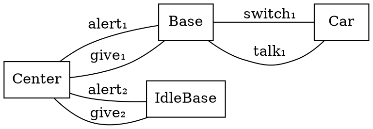
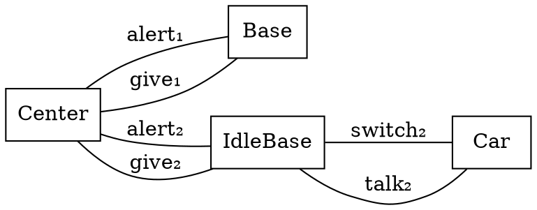

# Strong and Weak Bisimulations

We have seen _strong_ (bi)simulation where every transition is matched by a single other transition.
We can weaken that to allow the insertion of silent transitions.

A _weak simulation relation_ $R$ a relation between the states of $A$ and $B$ with the following property:
$∀ a ∈ Σ, s_A,t_A ∈ S_A, s_B ∈ S_B. R(s_A, s_B) ∧ s_A \stackrel{a}{→_A} t_A ⇒
    ∃ x,y,t_B ∈ S_B. s_B \stackrel{τ^\*}{→_B} x ∧ x \stackrel{a}{→}  y ∧ y \stackrel{τ^\*}{→_B} t_B ∧ R(t_A, t_B)$.

If both $R$ and its inverse $R⁻¹$ are weak simulation relations then $R$ is a weak bisimulation.

Weak bisimulations are often written as $≈$.

We can infere weak bisimulation by reinterpreting SGE with $≈$ instead of $=$ and adding the following axioms:
* $α.τ.P ≈ α.P$
* $P + τ.P ≈ τ.P$
* $α.(P + τ.Q) + α.Q ≈ α.(P + τ.Q)$

This axiomatization of weak bisimulation has been shown to be sound and it may be complete for finite processes
(see Section 5.5 of [A Calculus of Mobile Processes Pt.1](http://www.lfcs.inf.ed.ac.uk/reports/89/ECS-LFCS-89-85/)).

_Remarks._
In the coin flip example from [notes 8](viewer.html?md=concurrency_theory_2018/notes_8.md), the two models of the $coin$ are not weakly bisimilar.


# The π-calculus

The π-calculus is a successor of CCS that tries to additionally model the dynamically changing communication topology.
This is often called _mobility_.
To enable mobility messages can carry names.


## Motivating Example

Let us look at a simplified version of the GSM handover protocol from [The Polyadic pi-Calculus: A Tutorial](http://www.lfcs.inf.ed.ac.uk/reports/91/ECS-LFCS-91-180/).
The system is composed of:
* a car that moves around,
* two base stations which act as relay for the communication to the car,
* a switching center which tries to keep the connection to the car though one of the base station.

Intuitively, the system looks like:


```
Car(talk, switch) ≝   ?talk.Car(talk, switch)
                    + !talk.Car(talk, switch)
                    + ?switch(talk′, switch′).Car(talk′, switch′)
Base(talk, switch, give, alert) ≝   ?talk.Base(talk, switch, give, alert)
                                  + !talk.Base(talk, switch, give, alert)
                                  + ?give(t, s).!switch(t, s).IdleBase(talk, switch, give, alert)
IdleBase(talk, switch, give, alert) ≝ ?alert.Base(talk, switch, give, alert)
Center(t₁, t₂, s₁, s₂, g₁, g₂, a₁, a₂) ≝ !g₁(t₂, s₂).!a₂.Center(t₂, t₁, s₂, s₁, g₂, g₁, a₂, a₁)
```


And the initial state of the system is:
```
(ν talk₁ talk₂ switch₁ switch₂ give₁ give₂ alert₁ alert₂)(
    Car(talk₁, switch₁) |
    Base(talk₁, switch₁, give₁, alert₁) |
    IdleBase(talk₂, switch₂, give₂, alert₂) |
    Center(talk₁, talk₂, switch₁, switch₂, give₁, give₂, alert₁, alert₂)
)
```

Let us look at what happens during the handover.

By expanding some definitions from the initial state we get:
```
(ν talk₁ talk₂ switch₁ switch₂ give₁ give₂ alert₁ alert₂)(
    (?talk₁.Car(talk₁, switch₁) + !talk₁.Car(talk₁, switch₁) + ?switch₁(t, s).Car(t, s)) |
    (?talk₁.Base(talk₁, switch₁, give₁, alert₁) + !talk₁.Base(talk₁, switch₁, give₁, alert₁) + ?give₁(t, s).!switch₁(t, s).IdleBase(talk₁, switch₁, give₁, alert₁)) |
    ?alert₂.Base(talk₂, switch₂, give₂, alert₂) |
    !give₁(talk₂, switch₂).!alert₂.Center(talk₂, talk₁, switch₂, switch₁, give₂, give₁, alert₂, alert₁)
)   
```
after synchronizing on `give₁` we have:
```
(ν talk₁ talk₂ switch₁ switch₂ give₁ give₂ alert₁ alert₂)(
    (?talk₁.Car(talk₁, switch₁) + !talk₁.Car(talk₁, switch₁) + ?switch₁(t, s).Car(t, s)) |
    !switch₁(talk₂, switch₂).IdleBase(talk₁, switch₁, give₁, alert₁) |
    ?alert₂.Base(talk₂, switch₂, give₂, alert₂) |
    !alert₂.Center(talk₂, talk₁, switch₂, switch₁, give₂, give₁, alert₂, alert₁)
)   
```
after synchronizing on `switch₁` we have:
```
(ν talk₁ talk₂ switch₁ switch₂ give₁ give₂ alert₁ alert₂)(
    Car(talk₂, switch₂) |
    IdleBase(talk₁, switch₁, give₁, alert₁) |
    ?alert₂.Base(talk₂, switch₂, give₂, alert₂) |
    !alert₂.Center(talk₂, talk₁, switch₂, switch₁, give₂, give₁, alert₂, alert₁)
)   
```
after synchronizing on `alert₂` we have:
```
(ν talk₁ talk₂ switch₁ switch₂ give₁ give₂ alert₁ alert₂)(
    Car(talk₂, switch₂) |
    IdleBase(talk₁, switch₁, give₁, alert₁) |
    Base(talk₂, switch₂, give₂, alert₂) |
    Center(talk₂, talk₁, switch₂, switch₁, give₂, give₁, alert₂, alert₁)
)   
```

Visually, the new state is:



## Syntax

__Process definitions.__
A set of mutually recursive definitions of the form: $A(\vec a) ≝~ P$
where
* $A$ is the identifier of the process
* $\vec a$ is a list of _names_
* $P$ is a process

__Processes.__
$
\begin{array}{rcll}
   P & ::= & π.P            & \text{(action)}   \\\\
     &   | & P + P   \qquad & \text{(choice)}  \\\\
     &   | & P |~ P         & \text{(parallel composition)} \\\\
     &   | & (νa) P         & \text{(restriction)} \\\\
     &   | & A(\vec a)      & \text{(named process)} \\\\
     &   | & 0              & \text{(end)}
\end{array}
$

__Actions.__
$
\begin{array}{rcll}
   π & ::= & !a(\vec a)           & \text{(send)}   \\\\
     &   | & ?a(\vec a)  \qquad   & \text{(receive)}  \\\\
     &   | & τ                    & \text{(silent)}
\end{array}
$

_Remark._
The difference between CCS and the π-calculus is the number of names in input/output prefix:
* when no name are involved: CCS
* with 1 name in the prefix: _monadic_ π-calculus
* with >1 name in the prefix: _polyadic_ π-calculus

We can encode CCS in the π-calculus by sending a dummy name that is never used to synchronize.

To encode the polyadic π-calculus into the monadic π-calculus, we can serialize the argument over a private name:
* $!a(b₁ … b_n)$ becomes $(ν arg)!a(arg).!arg(b₁).…!arg(b_n)$
* $?a(b₁ … b_n)$ becomes $?a(arg).?arg(b₁).…?arg(b_n)$


## Free names and bound names

Compared to CCS, the bound and free names have to account for message reception as it binds name.

The free names ($fn$) are the names that occurs in a processes but are not restricted:
* $fn(0) = ∅$
* $fn(τ.P) = fn(P)$
* $fn(!a(\vec b).P) = fn(P) ∪ \\{a, \vec b\\}$
* $fn(?a(\vec b).P) = fn(P) ∪ \\{a\\} ∖ \\{\vec b\\}$
* $fn(P + Q) = fn(P) ∪ fn(Q)$
* $fn(P | Q) = fn(P) ∪ fn(Q)$
* $fn((νa)P) = fn(P) ∖ \\{a\\}$
* $fn(A(\vec a)) = \\{\vec a\\}$

The dual of free names are bound names ($bn$).
The names occurring under a restriction or an input prefix:
* $bn(0) = ∅$
* $bn(τ.P) = bn(P)$
* $bn(!a(\vec b).P) = bn(P)$
* $bn(?a(\vec b).P) = bn(P) ∪ \\{\vec b\\}$
* $bn(P + Q) = bn(P) ∪ bn(Q)$
* $bn(P | Q) = bn(P) ∪ bn(Q)$
* $bn((νa)P) = bn(P) ∪ \\{a\\}$
* $bn(A(\vec a)) = ∅$

__No clash assumption.__
Like for CCS, we assume that $fn(P) ∩ bn(P) = ∅$.


## Structural congruence

The structural congruence rules are the same as in CSS with the addition of renaming of the names bound by input prefixes:
- $c ∉ fn(P) ∧ c ∉ bn(P) ⇒ ?a(b).P ≡ ?a(c).P[c/b]$


## Semantics

### Labeled semantics (for open or closed world)

The semantics of the pi-calculus is very similar to CCS but it also carries the payload of the messages:

* Silent action
  \\[{
  }\over{
    τ.P  \stackrel{τ}{→}  P
  }\\]
* Send action
  \\[{
  }\over{
    !a(\vec b).P  \stackrel{!a(\vec b)}{→}  P
  }\\]
* Receive action
  \\[{
    \\{\vec c\\} ∩ bn(P) = ∅
  }\over{
    ?a(\vec b).P  \stackrel{?a(\vec c)}{→}  P[c/b]
  }\\]
  \\[{
    P  \stackrel{π}{→}  P'
  }\over{
    P+Q  \stackrel{π}{→}  P'
  }\\]
* Parallel
  \\[{
    P  \stackrel{π}{→}  P'
  }\over{
    P|Q  \stackrel{π}{→}  P'|Q
  }\\]
* Communication
  \\[{
    P  \stackrel{!a(\vec b)}{→}  P' \qquad
    Q  \stackrel{?a(\vec b)}{→}  Q'
  }\over{
    P|Q  \stackrel{τ}{→}  P'|Q'
  }\\]
* Restriction
  \\[{
    P  \stackrel{π}{→}  P' \qquad π ≠ !a(␣) \qquad π ≠ ?a(␣) \qquad π ≠ !␣(… a …) \qquad π ≠ ?␣(… a …)
  }\over{
    (νa)P  \stackrel{π}{→}  (νa)P'
  }\\]
* Congruence
  \\[{
    P ≡ P' \qquad P' \stackrel{π}{→} Q' \qquad Q' ≡ Q
  }\over{
    P \stackrel{π}{→} Q
  }\\]

_Notation._
In the restriction rule, we use $␣$ to denote names that do not matter (implicitely unviersally quantified).

_Remark._
Unfortunately, this semantics is not finitely branching.
Consider the process $?a(b).!b.0$.
This process can take infinitely many transitions:
* $?a(b).!b.0 \stackrel{?a(c)}{→} !c.0$
* $?a(b).!b.0 \stackrel{?a(d)}{→} !d.0$
* ...


### Unlabeled semantics (only for closed world)

An infinitely branching semantics can be problem for some type of analysis and people have developed alternative semantics that are finitely branching but only work under the closed-world hypothesis.
In this semantics, the send and receive are directly matched to resolve the name of the payload.
Therefore, all the transition silent and this semantics is unlabeled.

* Silent action
  \\[{
  }\over{
    τ.P  →  P
  }\\]
* Parallel
  \\[{
    P  →  P'
  }\over{
    P|Q  →  P'|Q
  }\\]
* Communication
  \\[{
  P = … + !a(c).P' + … \\qquad  Q = … + ?a(b).Q' + … \\qquad \\{\vec c\\} ∩ bn(Q) = ∅
  }\over{
        P|Q  →  P'|Q'[c/b]
  }\\]
* Restriction
  \\[{
      P → P'
  }\over{
  (νa)P → (νa)P'
  }\\]
* Congruence
  \\[{
    P ≡ P' \qquad P' \stackrel{π}{→} Q' \qquad Q' ≡ Q
  }\over{
    P \stackrel{π}{→} Q
  }\\]


## More Examples


### Server with unboundedly many clients (names as network addresses)

We saw an example of mobility in a system with a constant number of processes.
However, mobility is particularly useful in systems with many processes.

For instance, consider the following system:
```
Server(s) ≝ ?s(c).(Server(s) | Session(c))
Session(c) ≝ ?c().!c().Session(c)
NewClient(s) ≝ τ.(NewClient(s) | Client(s))
Client(s) ≝ (νc) !s(c).ClientConnected(c)
ClientConnected(c) ≝ !c().?c().ClientConnected(c)
```
with the initial state `(νs)(Server(s) | NewClient(s))`

In this system, a process represent a server and each time a client connects to the server, the server learn a new address and create a session to handle the communication with the client.


### Concurrent list (names as pointers)

Even though the π-calculus was initial targeted at message-passing systems, mobility can express other types of systems.
In particular, names can be seen as references or pointers.


For instance, we can look at the insertion in a lock-coupling concurrent list ([source of the example](https://people.mpi-sws.org/~viktor/cave/examples/LC_set.cav)).
For the sake of simplicity we look at the abstracted version below (no data, infinite list, ...):
```c
 0: void add() {
 1:     Node prev = head;
 2:     prev->lock();
 3:     Node curr = prev->next;
 4:     while(*) {
 5:         curr->lock();
 6:         prev->unlock();
 7:         prev = curr;
 8:         curr = prev->next;
 9:     }
10:     if (*) {
11:         curr->lock();
12:         Node temp = new();
13:         temp->next = curr;
14:         prev->next = temp;
15:         curr->unlock();
16:     }
17:     prev->unlock();
18: }
```

We can encode this in the π-calculus as follow:
```
NodeUnlocked(this, get, set, lock, unlock, next) ≝ !this(get, set, lock, unlock).NodeUnlocked(this, get, set, lock, unlock, next)
                                                   + ?lock().NodeLocked(this, get, set, lock, unlock, next)
                                                   + !get(next).NodeUnlocked(this, get, set, lock, unlock, next)
                                                   + ?set(n).NodeUnlocked(this, get, set, lock, unlock, n)
NodeLocked(this, get, set, lock, unlock, next) ≝ !this(get, set, lock, unlock).NodeLocked(this, get, set, lock, unlock, next)
                                                 + ?unlock().NodeUnlocked(this, get, set, lock, unlock, next)
                                                 + !get(next).NodeLocked(this, get, set, lock, unlock, next)
                                                 + ?set(n).NodeLocked(this, get, set, lock, unlock, n)
Add01() ≝ τ.Add02(head)
Add02(prev) ≝ ?prev(get, set, lock, unlock).!lock().?get(curr).Add04(prev,curr)
Add04(prev,curr) ≝ τ.Add05(prev,curr)
                   + τ.Add10(prev,curr)
Add05(prev,curr) ≝ ?curr(get, set, lock, unlock).!lock().Add06(prev,curr)
Add06(prev,curr) ≝ ?prev(get, set, lock, unlock).!unlock().Add08(curr,curr)
Add08(prev,curr) ≝ ?prev(get, set, lock, unlock).?get(next).Add04(prev,next)
Add10(prev,curr) ≝ τ.Add11(prev,curr)
                   + τ.Add17(prev)
Add11(prev,curr) ≝ ?curr(get, set, lock, unlock).!lock().Add12(prev,curr)
Add12(prev,curr) ≝ (ν temp, get, set, lock, unlock)(Add14(prev,curr,temp) | NodeUnlocked(temp, get, set, lock, unlock, curr))
Add14(prev,curr,temp) ≝ ?prev(get, set, lock, unlock).!set(temp).Add15(prev,curr)
Add15(prev,curr) ≝ ?curr(get, set, lock, unlock).!unlock().Add17(prev)
Add17(prev) ≝ ?prev(get, set, lock, unlock).!unlock().0
```

## Expressive Power

Since CCS can encode Minsky machine and the π-calculus is a superset of CCS, the π-calculus is also a Turing complete model.
