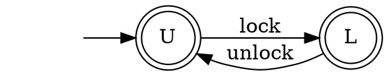
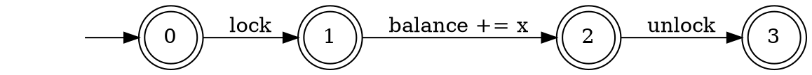

# Homework 1

_Instructions_
* Due on November 5.
* Send your solution by email to Felix Stutz.
* You can work in groups up to 3 people, be sure to include the names of all the participants.
* You can submit your solution in pdf or text format. For the exercises using Spin give the promela source file as well. Place all your files in a single archive (zip or tar.gz).

__Some Administration__

We need to find a time for the exercise session.
We will try to find a time which satisfies the most people.
The options are:
1. ???
2. ???
3. ???

Please send to Felix by email you availabilities.
For the slots when you are available, you can also rank them by preference.
We will do our best to accommodate the maximum number of people.

__Remark.__

We know that you can easily find the solutions of these exercises online.
The goal of this exercise it so evaluate how you do solve them.
So please, try to do it by yourself.
For the first week, we reuse exercises from previous years to give us a comparison point.
Starting with the 2nd week we will use new exercises.
Thanks.


## Correctness of the Determinization Construction

Complete the proof of correctness of the determinization construction.

Let `N` be a NFA and `D` be a DFA obtained from `N` using the powerset construction.
Show that any word accepted by `D` is also accepted by `N`: `w ∈ L(D) ⇒ w ∈ L(N)`.


## Encoding Programs as Automaton

Recall the lock automaton:



And the increment program:
```c
int balance;

void increase(int x) {
    lock();
    balance += x;
    unlock();
}
```
and the corresponding automaton:


__Tasks 1.__
Generalize this example to use a `semaphore` instead of a lock.
A semaphore generalize a lock with counting.
The equivalent of `lock` is `acquire` and `release` instead of `unlock`.
However a semaphore allows up to `n` processes to `acquire` permits before a process releases one permit.
`n` is a parameter given during the creation of the semaphore.

Instantiate your example with 3 `increase` program and a semaphore with `n=2`.

You are allowed to change the automata (states, alphabet, transition, etc.).
If this is possible, suggest an alternate model where this is possible.

__Task 2.__
Generalize this example to make the lock _reentrant_.
A reentrant lock allows one thread to `lock` the same lock multiple times.
The lock must be `unlock`ed the same number of times it was `lock`ed before a new process can acquire it.

You are allowed to change the automata (states, alphabet, transition, etc.).
If this is possible, suggest an alternate model where this is possible.


## Longest (Worst Case) Shortest Counterexample to a Safety Property for Automata

Consider the setting where we have a program and a safety property encoded as automata.
For instance, this is the setting of the previous example.
Let us further assume that the automaton are DFAs.

* Assume the automaton for the program has `m` states, the property has `n` states, and the program does not respect the property.
  This means that the product of the program and the negated property is non-empty.
  In the worst case, how long is the shortest word in the product of the program and the negated property?
* Can you construct an example that reaches your bound?
* Prove your bound
* What happens when there are many copies of the program (e.g. concurrency)? _hint._ this is one of the reason testing concurrent programs is hard.


## [Optional] Install Spin

We will use Spin in the coming weeks, so it is good that you already install it.

You can download Spin at: http://spinroot.com/

To run spin, we recommend using the following script: https://github.com/tcruys/runspin

As exercise, you can encode the lock-and-increment example from the example above and use Spin to show mutual exclusion for `n` copies of the increment program (`n∈[2,6]`).
Since Spin does not natively include locks, you will need to find a way to encode one.
