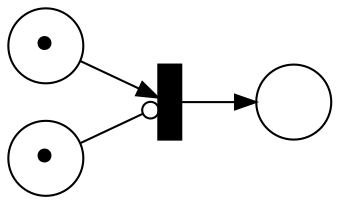
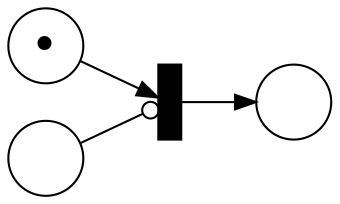
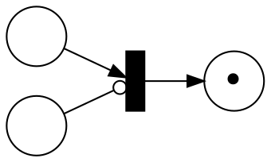

# Homework 3

_Instructions_
* Due on November 18, Monday, at 8am.
* Send your solution by email to Felix Stutz. Please prefix your email subject with `[CT19-SUB]`.
* We expect you to work in groups of 3 to 4 people, be sure to include the names of all the participants **and your group number** in the document.
* Please submit your solutions in one readable pdf file. Based on the experiences for the first exercise sheet, we require you to **typeset your solutions** as announced in the tutorial.
  We exclude automata, petri nets etc. from this requirement for now but please ensure that they are legible and scanned (no photos).
  For the exercises using Spin give the promela source file as well. Place all your files in a single archive (zip or tar.gz).

## On co-linear properties

When using an LP solver to verify safety properties (reachability), we saw that we can only encode co-linear properties, i.e., properties which violation satisfies $A \cdot M ≥ B$ where $M$ is a marking.

Let us try to use co-linear properties to answer some types of safety properties.
A safety property is a set of states, $A \cdot M ≥ B$ is a special kind of set.

### Tasks
* _Bounded reachability._
  Sometime we are interested to find if a system can satisfy a property for a certain duration.
  Given a co-linear property, we are interested if that property is maintained for $t$ transitions.
  Give the formulation of this problem as an ILP.
* _Deadlock freedom._ Can you encode deadlock freedom as a co-linear property / ILP problem?
* Can you find an example of a safety property which is _not_ co-linear?


## (Weak) Computations with Petri nets, part 1

Petri nets are good model for concurrent programs.
But to use them we need to undertand what problem can be solved by Petri nets.
In other word we need to understand what Petri nets can compute.

Let us try to compute functions using Petri nets.
The goal is to create gadgets, i.e. small nets which can later be combined to create larger nets.

In this exercise, the gadgets you create needs to have some specially named place: $x$, $y$, and $o$.
$x$ and $y$ are the input places and $o$ will is the output place.

### Task

* Create net such that if $M₀(x) = m$, $M₀(y) = n$, and $M₀(o) = 0$ then when the net terminates the final marking $M$ has $M(o) = m+n$.
* Create net such that if $M₀(x) = m$, $M₀(y) = n$, and $M₀(o) = 0$ then when the net terminates the final marking $M$ has $0 ≤ M(o) ≤ m⋅n$.

In both cases provide the initial marking of the additional places you might have added and argument why your Petri nets do what they should.
The fact that the multiplication cannot be done exactly but only achieve in a maximal run is referred to as _weakly_ computing a function (in this case the multiplication).

* Our goal is to weakly compute [diophantine equations](https://en.wikipedia.org/wiki/Diophantine_equation) because they can lead to challenging problems like [Hilbert's tenth problem](https://en.wikipedia.org/wiki/Hilbert%27s_tenth_problem).
  Given an diophantine equation explain how to use the gadgets you developed above to create a net which weakly compute its result.


## (Weak) Computations with Petri nets, part 2

### Preliminaries: Petri Nets with Inhibitory Edges
An _Petri Net with inhibitory edges_ $N$ is a 4-tuple $(S, T, W, I)$ where
* $S$ is a finite set of places
* $T$ is a finite set of transitions
* $W$ is a weight function over $(S × T) ∪ (T × S) → ℕ$
* $I$ is a inhibition function over $T → (S ∪ {⊥})$

The difference between Petri net with and without inhibitory edges is when transitions are enabled.
Inhibitory edges block a transition from firing as long as the place with the inhibitory edge contain tokens.

More formally, a transition $t$ is enabled iff $(I(t) = ⊥ ∨ M(I(t)) = 0) ∧ ∀ s ∈ S. M(s) ≥ W(s,t)$.

_Example._

Consider the following net where $⊸$ represent an inhibitory edge:

In the net above, the transition cannot fire.

In the configuration below, the transition can fire.

After firing, we get:


### Tasks

* Can you find an example of a synchronization primitive which cannot be encoded as a Petri net but can be encoded using inhibitory edges?
* Use inhibitory edges to modify the construction you have developed in the 1st part to exactly compute diophantine equations.
* Generalize the construction to reduce [Hilbert's tenth problem](https://en.wikipedia.org/wiki/Hilbert%27s_tenth_problem) to reachability in nets with inhibitory edges.


## (Weak) Computations with Petri nets, part 3

### Preliminaries: Petri nets with transfer and reset edges

Let us consider two generalizations of Petri Nets:
* _transfer nets_ which have special edges that transfer the tokens from one place to another
* _reset nets_ which have special edges that consume all the tokens in a place

#### Definitions

An _Extended Petri Net_ $N$ is a 4-tuple $(S, T, W, R)$ where
* $S$ is a finite set of places
* $T$ is a finite set of transitions
* $W$ is a weight function over $(S × T) ∪ (T × S) → ℕ$
* $R$ is a transfer/reset function over $T → (S ∪ {⊥}) × (S ∪ {⊥})$

$⊥$ (bottom) is a dummy element used as placeholder for transition/places which are not connected to any reset/transfer edge.

We categorize the nets according to $R$ as follow:
* If $R(t) = (⊥, ⊥)$ for all $t$ then the net is a normal Petri net.
* If $R(t) = (s, ⊥) ∧ s ≠ ⊥$ then there is a _reset edge_ from $s$ to $t$ and the net is a _reset net_.
* If $R(t) = (s, s') ∧ s ≠ ⊥ ∧ s' ≠ ⊥$ then the transition $t$ is a _transfer edge_ from $s$ to $s'$ and the net is a _transfer net_.

Furthermore, $R$ respects the following:
* $R(t) = (s, s') ∧ s' ≠ ⊥ ⇒ s ≠ ⊥$.
* $R(t) = (s, s') ∧ s ≠ ⊥ ∧ s' ≠ ⊥ ⇒ s ≠ s'$.
* On top of normal edges a net can have either transfer or reset edges but not both.

Let us explain what firing a transition means in the context of extended Petri net.

$t$ is enabled at $M$ iff $∀ s ∈ S.~ M(s) ≥ W(s,t)$.
This is similar to Petri nets.

$M [t〉 M'$ is computed as follow:
1. $t$ must be enabled at $M$
2. create an intermediate marking $M₁$ where $M₁(s) = M(s) - W(s,t)$.
3. assume $R(t) = (s₁,s₂)$ create an intermediate marking $M₂$ to apply the reset/transfer:
  * if $s ≠ s₁ ∧ s ≠ s₂$ then $M₂(s) = M₁(s)$
  * if $s = s₁$ then $M₂(s) = 0$
  * if $s = s₂$ then $M₂(s) = M₁(s) + M₁(s₁)$
4. compute the final marking: $M'(s) = M₂(s) + W(t,s)$.

#### Reset net example

Consider the following reset net where `⥇` represent the reset edge:
```
(∙)       ( )
    ↘   ↗
(:) ⥇ |
```

After firing the transition we get:
```
( )       (∙)
    ↘   ↗
( ) ⥇ |
```

#### Transfer net example

Consider the following transfer net where `⇒` represent the transfer edges:
```
(∙)       ( )
    ↘   ↗
(:) ⇒ | ⇒ (∙)
```

After firing the transition we get:
```
( )       (∙)
    ↘   ↗
( ) ⇒ | ⇒ (⫶)
```

__FIXME graphviz the pictures__

### Tasks

Let us check how transfer and reset edges compare to inhibitory edges.

* Can you update your construction from part 2 to work with transfer edges?
* Can you update your construction from part 2 to work with reset edges?

(_Hint_: You need to use the property of the edge in conjunction with the reachability objective.
It is not possible to exactly emulate inhibitory edge but it is possible to detect when an inhibitory transition has not been properly emulated.)
