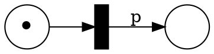

# Homework 4

_Instructions_
* Due on Dec 2, Monday, at 8am.
* Send your solution by email to Felix Stutz. Please prefix your email subject with `[CT19-SUB]`.
* We expect you to work in groups of 3 to 4 people, be sure to include the names of all the participants **and your group number** in the document.
* Please submit your solutions in one readable pdf file. Based on the experiences for the first exercise sheet, we require you to **typeset your solutions** as announced in the tutorial.
  We exclude automata, petri nets etc. from this requirement for now but please ensure that they are legible and scanned (no photos).
  For the exercises using Spin give the promela source file as well. Place all your files in a single archive (zip or tar.gz).


## Parametric Petri Nets (PPN)

A PPN is a Petri net where the number of tokens involved in a transition is parameterised.
For instance, consider the following net



The transition's output is parameterized by $p$.

More formally, a _Parametric Petri Net_ $N$ is a 4-tuple $(S, T, P, W)$ where
* $S$ is a finite set of places
* $T$ is a finite set of transitions
* $P$ is a finite set of parameters
* $W$ is a weight function over $(S × T) ∪ (T × S) → (ℕ ∪ P)$

Given a valuations of the parameters $ρ: P ⇒ ℕ$ and a parametric net with parameters $P$, we can replace every $p ∈ P$ by $ρ(p)$ and we get an normal Petri net.

PPN are very expressive and, therefore, we are going to limit ourself to particular kinds of PPN:
- a pre-PPN only allows parameters in the edges from places to transitions;
- a post-PPN only allows parameters in the edges from transitions to places;
- a distinct-PPN does not have transitions with parameters in both the incoming and outgoing edges.

The example above of a post-PPN.

Given a PPN and an initial marking, the covering question is a bit modified to existential covering:
- existential covering: Does there exists a valuation of the parameter such that the net can cover a marking?
- universal covering: Can the net cover a marking for all parameter valuations?

### Questions
* How would you approach the existential covering problem for post-PPN?
* How would you approach the existential covering problem for pre-PPN?
* How would you approach the existential covering problem for distinct-PPN?
* How would you approach the universal covering problem for post-PPN?
* How would you approach the universal covering problem for pre-PPN?
* How would you approach the universal covering problem for distinct-PPN?


# Karp-Miller Automaton

Most of the analysis we did on Petri nets only looks at markings.

Let us try to reuse some of the theory we developed to also reason about traces of Petri nets.
In particular, we are going to modify the Karp-Miller tree and turn it into an NFA.

Consider the following modified Karp-Miller algorithm:

```
KarpMillerTree(M₀)
    T = {r:M₀}  // initial tree: root r with marking M₀, r unmarked
    E = {}      // extra edges for the automata 
    while T contains an unmarked node c:M  do
        if c has an ancestor c′:M′ with M = M′ then
            mark c
            E += { (c,ε,c′) }
        else
            if c has an ancestor c′:M′ with M′<M then
                let c′ be the closest such ancestor
                let w by the sequence of transitions from c to c′
                replace c:M by c:accelerate(M, w) in T
                E += { (c,ε,c′) }
            for each transition t enabled at M and M′ such that M [t〉 M′
                add a new node d:M′ in T
                add an edge (c,t,d) in T
            mark c
    return an NFA with initial state r, all states are accepting, and the transitions are T ∪ E
```

### Questions

* Let us first only look at the tree `T` and ignore the extra edges `E`.
  How does this algorithm compare to the one seen in class (week 3)?
  Is it still correct?
* Assuming that the algorithm is correct, let us look at the automata returned by the algorithm.
  - Is a sequence of transitions accepted by the automaton is fireable from `M₀`?
  - Is any sequence fireable form `M₀` accepted by the automaton?
* Let us optimize the algorithm and replace line 5.
  The original version is 
  ```
  if c has an ancestor c′:M′ with M = M′ then
  ```
  and the new version is 
  ```
  if c has an ancestor c′:M′ with M ≤ M′ then
  ```
  Revisit the first two questions with this optimization.

For the three questions:
  If yes, can you sketch a proof?
  If no, can you find a counter-example?


## QO with Finite Basis

In the 4th week of the class, we discussed well-quasi-orderings (WQO).

Related to WQO, we saw the following lemma: "If $(X,≤)$ is a WQO, then any upward-closed set has a finite basis".

Now, we are wondering about the reverse direction: "If $(X,≤)$ is a QO and any upward-closed set has a finite basis then (X,≤) is a WQO".

### Question

* Do you think that the reverse direction of the claim is true? (Finite basis implies WQO.)
  If yes, can you sketch a proof?
  If no, can you find a counter-example?


## On Strong and Strict Monotonicity

In the definition of WSTS, one key element is the monotonicity.
Monotonicity links the transition relation to the ordering.

There are a few variations of monotonicity: strong, strict, stuttering.

Furthermore, we can also combine these properties.
For instance, there is strong-strict monotonicity, a variation where strong and strict monotonicity hold at the same time.
Here is the definition of strong-strict monotonicity for labelled transition systems:
\\[
 ∀ x₁ a x₂ y₁.\ ∃ y₂.\ x₁ \stackrel{a}{→}x₂ ∧ x₁ < y₁ ⇒  y₁ \stackrel{a}{→}y₂ ∧ x₂ < y₂
\\]

### Questions
* In the case of strong-strict monotonicity, explain why strong monotonicity and strict monotonicity together are still weaker than strong-strict monotonicity.
  Try to build an example which has strong and strict monotonicity but not strong-strict monotonicity.
