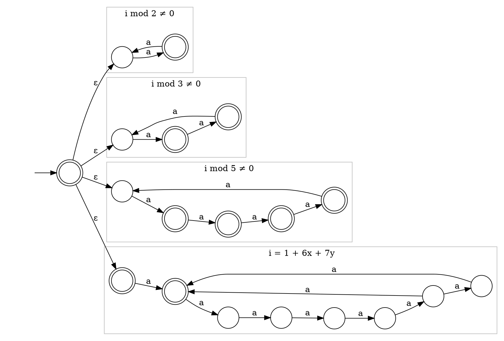

# Solution 2

We thank Tobias Jeske, Andreas Klein, and Alexander Schneiders for helping us with their solution.

## Shuffle Product for Automata

The shuffle product of two words generates all the interleaving of the words.
We achieve this behavior by simulating both automata, but instead of both automata making a step, only one of them is allowed to make a step at each point.
In case both automata could make a step with the same symbol they don't perform the step together (like in the synchronized product), but separately.
Meaning there will be two outgoing edges with the same symbol in our product automaton (introducing non-determinism). 

### Construction

Given two NFAs
$A = (Q_A, \Sigma_A, q_0^A, \delta_A, F_A)$ and
$B = (Q_B, \Sigma_B, q_0^B, \delta_B, F_B)$ we construct an NFA
$A ~⧢~ B = (Q, \Sigma, q_0, \delta, F)$ with:

* $Q = Q_A \times Q_B$
* $\Sigma = \Sigma_A \cup \Sigma_B$
* $q_0 = (q_0^A, q_0^B)$
* $(q_A', q_B') ∈ \delta((q_A,q_B),x) ⇔ \bigvee
        \begin{cases}
            q_A' ∈ \delta_A(q_A,x) ∧ q_B' = q_B \qquad \quad \text{($A$-step)}\\\\
            q_A' = q_A ∧ q_B' ∈ \delta_B(q_B,x) \qquad \quad \text{($B$-step)}
        \end{cases}$
* $F = F_A \times F_B$

### Correctness

Before we start, we can observe that we can write an equivalent definition of the shuffle which append instead of prepending symbol.
This alternative definition is:
* $ua ~ ⧢ ~ vb = \\{ wa ~|~ w \in (u ~ ⧢ ~ vb) \\} \cup \\{ wb ~|~ w \in (ua ~ ⧢ ~ v) \\}$,
* $ε ~ ⧢ ~ v = \\{v\\}$,
* $u ~ ⧢ ~ ε = \\{u\\}$

It is easy to show that the two definitions are equivalent, so we omit this. 😎

The correctness is showing the following statement:
\\[ w \in L(A ~⧢~ B) ⇔ ∃ u,v.~ u \in L(A) ∧ v \in L(B) ∧ w \in u ~⧢~ v \\]

To prove this, it is simpler if we can reason about the traces of the automaton.

_Notation._
Let $q \stackrel{w}{→}_M q'$ denote the fact that there exists a trace of the NFA $M$ over the word $w$ from the state $q$ to the state $q'$.
Remember that a trace does not need to be accepting.

Before we prove the final result, we show an intermediate result:
\\[ (q_A,q_B) \stackrel{w}{→}_{A⧢B} (q_A',q_B') ⇔ ∃ u,v. ~ w ∈ u ~⧢~ v ∧ q_A \stackrel{u}{→}_A q_A' ∧ q_B \stackrel{v}{→}_B q_B' \\]

__$\Rightarrow$__ We prove this by induction over $w$.
* **Initial:**
  Let $w = ε$.
  - $u=v=ε$ satisfy the above statement (expanding the definitions and simplifying.)
* **Induction Step:**
  Let $w = w'a$.
  - The induction hypothesis is $(q_A,q_B) \stackrel{w'}{→}_{A⧢B} (q_A',q_B') ⇒ ∃ u',v'. ~ w' ∈ u' ~⧢~ v' ∧ q_A \stackrel{u'}{→}_A q_A' ∧ q_B \stackrel{v'}{→}_B q_B'$.
  - Furthermore, let $(q_A',q_B') \stackrel{a}{→}_{A⧢B} (q_A'',q_B'')$ be the last step of $A ~⧢~ B$.
  - Case split:
    + If the step is an $A$-step in the definition above then $u = u'a ∧ v = v'$ and we get the expected result by expanding the definition of run and the alternative definition of shuffle.
    + Otherwise this is a $B$-step and we can use the same argument with $u = u' ∧ v = v'a$.

__$\Leftarrow$__ We prove this by induction over $w$.

* **Intial:**
  Let $w = u = v = ε$.
  - We have that $(q_A,q_B) \stackrel{ε}{→}_{A⧢B} (q_A,q_B)$
* **Induction Step:**
  Let $w = w'a$.
  - The induction hypothesis is $(q_A,q_B) \stackrel{w'}{→}_{A⧢B} (q_A',q_B') ⇐ ∃ u',v'. ~ w' ∈ u' ~⧢~ v' ∧ q_A \stackrel{u'}{→}_A q_A' ∧ q_B \stackrel{v'}{→}_B q_B'$.
  - By definition of the shuffle we have that $(u = u'a ∧ v = v) ~∨~ (u = u' ∧ v = v'a)$.
  - Case split:
    + if $q_A \stackrel{u'}{→}_A q_A' \stackrel{a}{→}_A q_A''$ then
    $(q_A,q_B) \stackrel{w}{→} (q_A'',q_B')$ by the definition of $A$-step.
    + if $q_B \stackrel{v'}{→}_B q_B' \stackrel{a}{→}_B q_B''$ we have a similar but with a $B$-step.

This shows the intermediate statement.

We sketch how to use the intermediate statement to prove the original goal: 
\\[ w \in L(A ~⧢~ B) ⇔ ∃ u,v.~ u \in L(A) ∧ v \in L(B) ∧ w \in u ~⧢~ v \\].
First we apply the definition of the language accepted by an automaton $L(-)$ and get accepting runs, i.e. runs where the final state is accepting. 
Then we apply the result that we have just proved and the fact that $(q_A,q_B) ∈ F_A × F_B ~~ ⇔ ~~ q_A ∈ F_A ∧ q_B ∈ F_B$.

#### Comparison

In the shuffle product both automata run independent of each other.
The accepted words are all possible linearizations of the two processes.
In the synchronized product some actions need to be performed together by both processes.
That corresponds to processes that need to synchronize each other.

Remember the `lock-increment-unlock` running example from the lecture.
When we take the product of multiple program we had to change the alphabet of the programs so they only synchronize with the lock and not with each other.
We could model this example in a simpler way by first taking the shuffle product of the programs and then taking the synchronized product with the lock.

## Counting with an Automaton

The first important observation is that we are trying to construct an NFA.
So we have to use the non-determinism to our advantage.

The idea behind the construction is to have two parts:
1. one part which accepts the numbers which are not a multiple of 30, and
2. another part which accepts the numbers which are multiple of 30 strictly greater than 30.

For the first part, we can decompose that further into numbers which are not a multiple of 2, 3, and 5.
Here we can take advantage of the non-determinism to _guess_ which of these factor is the important one.

The 2nd part can be realized by observing that $∀ k > 1.~ ∃ x, y ≥ 0. ~ 30k = 1 + 6x + 7y$. 
One can prove this by induction on $k$. 
* Base: k = 2: 
	To show: $∃ x, y ≥ 0. ~ 60 = 1 + 6x + 7y$. 
	Solution: x = 4, y = 5.
* Induction Hypothesis: For some $k$, there exist $x, y ≥ 0$ such that $30k = 1 + 6x + 7y$. 
* Induction Step: 
	Given that IH holds for some k, we find parameters for $k+1$.
	To show: $∃ x', y' ≥ 0. ~ 30(k+1) = 1 + 6x' + 7y'$. 
	The parameters $x' = x + 5$ and $y' = y$ solve the equation and hence prove the claim.

The resulting automaton is:

