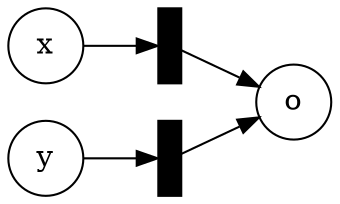
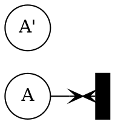

```graphviz
digraph PN {
	rankdir=LR;
    node [shape = circle, fixedsize = true, width = 0.5];
    p1 [ label="A" ];
    node [shape = box, label = "", style = filled, fillcolor = black, fixedsize = true, width = 0.15];  t1;
    p1 -> t1 [ arrowhead = odot ];
}
```

# Solution 3

__TODO this is a rough outline. Still need to add more explanations/proofs.__

## On co-linear properties

> _Bounded reachability._
> Sometime we are interested to find if a system can satisfy a property for a certain duration.
> Given a co-linear property, we are interested if that property is maintained for $t$ transitions.
> Give the formulation of this problem as an ILP.

Let us take the ILP formulation for normal colinear properties and add an extra constraints which limits the number of transitions to $t$.

Given a Petri Net $N = (S,T,W,M₀)$, let
$C$ be the connectivity matrix,
$A⋅M ≥ B$ a co-linear property, and
$X$ is a vector of size $|T|$.

\\[
\begin{array}{ll}
\text{Variables:}   & M, X \\\\
\text{Subject to:}  & M ≥ 0 \\\\
                    & X ≥ 0 \\\\
                    & M = M₀ + C⋅X \\\\
                    & A⋅M ≥ B \\\\
                    & X⋅1^T ≤ t
\end{array}
\\]

To sum the element of $X$ we will use an extra vector of $|T|$ filled with $1$.

$X⋅1^T ≤ t$ can be read as $∑_{0≤i<|T|} X(i) ≤ t$.

> _Deadlock freedom._ Can you encode deadlock freedom as a co-linear property / ILP problem?

We can try to encode a marking wich corresponds to a deadlock as a ILP constraints.
The idea is that in a deadlock for each transition there is at least one place which has fewer tocken than required.

Using variables with range in $\\{0,1\\}$ it is possible to encode conjunction and disjunction in ILP.
So we will write the constraints in booleans form.

Let $F$ be the forward matrix.

Deadlock freemdom is the complement of $\\{ M ~|~ ⋀_{0≤i<|T|} ⋁_{0≤j<|S|} M(j) < F(j,i) \\}$.

We use the complement (deadlock) of the property as it can directly be used by an ILP solver to find a counterexample to deadlock freedom.

> Can you find an example of a safety property which is _not_ co-linear?

A safety property is simply a set of markings, and therefor, we just need to exhibit a set of marking which cannot be characterized by linear constraints.

Given a Petri net with two places we can defined the set of makring $\\{ M ~|~ M(0) ≥ M(1)² \\}$.

## (Weak) Computations with Petri nets, part 1

> Create net such that if $M₀(x) = m$, $M₀(y) = n$, and $M₀(o) = 0$ then when the net terminates the final marking $M$ has $M(o) = m+n$.

> Create net such that if $M₀(x) = m$, $M₀(y) = n$, and $M₀(o) = 0$ satisfying the following constraint.
> For every number l with $0 ≤ l ≤ m⋅n$, there is a sequence of firing leading to marking $M$ such that $M(o) = l$.

__TODO ...__

> Given an diophantine equation explain how to use the gadgets you developed above to create a net which weakly compute its result.

Diophantine equations are over the integer domain.
However, Petri nets have natural number of tokens.
To represent a variable $x$ in the Petri net, we split is into a positive ($x₊$) and negative part ($x₋$) such that $x = x₊ - x₋$.
Taking to negate a number we just exchange the role of the negative and positive places.

Then the nets follow the steps:
* For each monomial:
  - assemble the addition and multiplication gadgets to compute the monomial
* output:
  - create a sum of the output of all the monomials into the overall output
* input:
  - create transitions which "guess" the values of the variables. For each variable create two transitions (one positive, one negative) which put tokens in the corresponding places for each monomials using the variable.

Finally, we need to define the reachability objective.
If we just put the contraints that the output place is zero then have a trivial solution corresponding to the initial state.
Therefore, we create one more "active place" (initially empty) and modify every transition to put a token in that place.
The final reachability objective is that all places must be empty except for the "active place" which has at least one token.

## (Weak) Computations with Petri nets, part 2

> Can you find an example of a synchronization primitive which cannot be encoded as a Petri net but can be encoded using inhibitory edges?

A barrier cannot be encoded with a normal Petri nets.
It is easy to do with inhibitory edges.
The transition corresponding to move past the barrier is inhibited as long as there are processes which have not yet reached the barrier.

> Use inhibitory edges to modify the construction you have developed in the 1st part or come up with a new gadget to exactly compute the multiplication: $M(o) = m⋅n$.

__TODO ...__

> Finding solutions of diophantine equations is undecidable ([Hilbert's tenth problem](https://en.wikipedia.org/wiki/Hilbert%27s_tenth_problem).)
> Explain how to use the gadgets you build to reduce that problem to reachability in nets with inhibitory edges.

__TODO ...__

## (Weak) Computations with Petri nets, part 3

In this part, we exploit the fact that we are looking at the reachability question.
The idea is to add extra places in the gadget and guess when inhibitory edges block transition.
A wrong guess will put a token in one of the extra place.
Then we use modify the reachability to force that the extra places are empty, and therefore, only correct guesses were made.

> Create a gadget to emulate an inhibitory edge with only normal and transfer edges.

For the inhibitory edges and transitions (omitting the normal edges):

We replace it by:

```graphviz
digraph PN {
	rankdir=LR;
    node [shape = circle, fixedsize = true, width = 0.5];
    p1 [ label="A" ];
    p2 [ label="G" ];
    node [shape = box, label = "", style = filled, fillcolor = black, fixedsize = true, width = 0.15];  t1;
    p1 -> t1 [  color = "black:invis:black" ];
    t1 -> p2 [  color = "black:invis:black" ];
}
```

And change the marking $M$ we want to reach to add the constraint $M(G) = 0$.

> Create a gadget to emulate an inhibitory edge with only normal and reset edges.

This is a bit more complicated as the reset get rid of tokens.
So for each place which is the source of an inhibitory edge, we create a "twin" place which copies the transition except for the inhibitory edge.
We replace the inhibitory edge by a reset edges on the normal place and nothing for the twin place.

For the inhibitory edges and transitions (omitting the normal edges):

We replace it by:

extend the transitions with $W(A,t) = W(A',t)$ and $W(t,A) = W(t,A')$, and update the reachability objective to requires that $M(A) = M(A')$.

For each transition that fires correctly, the number of token in the normal place and the twin place stays the same.
If a transition in the gadget does fire when there are tokens in $A$ then the number of tokens in $A$ and $A'$ will differ.

