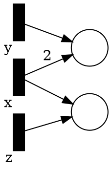
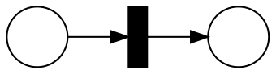

# Solutions 4

## Petri Nets with Parametric Initial Marking

> _existential covering_: is there a valuation $ρ$ such that $(N,ρ(\text{PM₀}))$ can cover $M$?

We simulate the parametric initial marking by guessing the valuation.
For each parameter we create a transition that "increment" the parameter by one, i.e., no incoming edges only outgoing edges with weight corresponding to the parameter coefficient.

For instance, if the parametric initial marking is $[2x + y, x + z]$, we would create

For every run of the parameterized system we can find a corresponding execution in the non-parameterized one.
First, we fire the transition which corresponds to the parameters' value then the net executes as normal.

Similarly, for every run in the non-parameterized net, we can find a valuation for the parameters by counting how many time the added transitions where fired.

> _universal covering_: Does $(N,ρ(\text{PM₀}))$ cover $M$ for all valuations $ρ$?

Because of monotonicity, the smallest valuation of the initial marking is simulated by the larger ones.
Therefore, we simply pick the valuation which maps all the parameters to $0$.

Note that all the other valuations give larger markings. Hence, if the smallest marking can cover $M$ then $M$ is covered by any other valuation.
Let $ρ₀$ be the valuation that maps the parameters for $0$.
$∀ρ.$ if $(N,ρ₀(\text{PM₀}))$ covers $M$, then $(N,ρ(\text{PM₀}))$ covers $N$.
Because $ρ(\text{PM₀}) ≥ ρ₀(\text{PM₀})$.

## Karp-Miller Tree for ℤ Petri Nets

> Does the Karp-Miller algorithm still work on $ℤ$ Petri net? Justify

No.
There can be infinite antichains and the algorithm does not terminate.

Consider the net

The set of reachable markings is $\\{ (-i,i) ~|~ i ∈ ℕ \\}$ which forms an infinite antichain.

> Does the backward algorithm still work on $ℤ$ Petri net? Justify

No.
On top of the antichain problem above, there is one more problem.
The algorithms does not terminate as $ℤ$ is not well-founded.
If the marking is not coverable the backward algorithm can generate smaller marking forever.

Consider the net

```graphviz
digraph PN {
	rankdir=LR;
    node [shape = circle, fixedsize = true, width = 0.5, label = "" ];
    x;
    node [shape = box, label = "", style = filled, fillcolor = black, fixedsize = true, width = 0.15];
    x -> t1;
}
```

The set of reachable marking is $\\{ (-i) ~|~ i ∈ ℕ \\}$ which forms an infinite descending chain.

> Can you think of a simpler algorithms for $ℤ$ Petri net? Justify

ILP becomes sound _and_ complete.

The problem with ILP is that it could not guarantee we could reconstruct a trace from the ILP solution.
If we are allowed to have negative tokens we can always reconstruct a trace.

## Different Kinds of Petri Nets Properties

> Explain what the properties are and the algorithms that can check them (if we covered any).

We have that in the lecture notes. 😁

> For the different properties, are there properties which are special cases of others?
> - When a property is a special case of another, try to find a reduction
> - When a property does not reduce to another, explain why not (try to find an example)

|               | Reachability | Covering | Deadlock | Co-linear |
|---------------|--------------|----------|----------|-----------|
| Reachability  |   ✓          |   ✗      |    ✗     |   ✓       |
| Covering      |   ✗          |   ✓      |    ✗     |   ✓       |
| Deadlock      |   ✗          |   ✗      |    ✓     |   ✗¹      |
| Co-linear     |   ✗          |   ✗      |    ✗     |   ✓       |

¹: in week 2 we had to introduce extra variables to simulate the boolean structure of a logical formula. Without the extra variables it is not possible.

> What changes if we consider the following generalizations of the properties:

> - reaching a marking in a given set of markings

1. Then it is possible to reduce all the properties to reachability of a set of markings.
2. It is not possible to reduce reachability to co-linear anymore.

> - covering a marking in a given set of markings

1. It is not possible to reduce coverability to co-linear anymore.

> - finite union of co-linear properties

1. It becomes possible to reduce deadlock to a finite union of co-linear properties by enumerating the solutions to the boolean formula.
2. It is possible to encode covering of a _finite_ set of markings.

## Lossy Petri Net with Inhibitory Edges (LN)

>  Is the covering problem solvable for LN?

Yes, we can reduce this version to Reset nets.
There are two changes to do:
1. replace the inhibitory edges by reset edges.
2. for each place add a transition which consumes one token from that place.

> Is the reachability problem solvable for LN?

Yes, as we build the lossiness into the semantics reachability and covering are the same for this model.
If we can cover a marking we can also reach it with the same trace.
We only need to chose smaller values that will get to the marking when firing the transitions.

