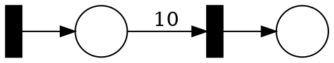

# Solution 5

## Parametric Petri Nets (PPN)

> How would you approach the existential covering problem for post-PPN?

Set the parameter values to $ω$.

> How would you approach the existential covering problem for pre-PPN?

Set the parameter values to $0$.

> How would you approach the existential covering problem for distinct-PPN?

Combination of the two above.

> How would you approach the universal covering problem for post-PPN?

Set the parameter values to $0$.

> How would you approach the universal covering problem for pre-PPN?

Remove an transition which has a parameter.
Such transition can never fire.

> How would you approach the universal covering problem for distinct-PPN?

Combination of the two above.

__TODO justifications...__


## Karp-Miller Automaton

> Let us first only look at the tree `T` and ignore the extra edges `E`.
> How does this algorithm compare to the one seen in class (week 3)?
> Is it still correct?

Yes, it is correct.

It is slightly less optimal as it stops exploring when it sees _exactly_ the same state.
Decreasing branches will be explore for longer (until they cannot fire anymore).

> Assuming that the algorithm is correct, let us look at the automata returned by the algorithm.
> - Is a sequence of transitions accepted by the automaton fireable from `M₀`?

No, the automaton over-approximate the traces of the net.
The problem occurs with acceleration.
Acceleration makes a loop in the automaton but the automaton does not count how many time the loop needs to be executed.

Consider the net:


The automaton for this example accepts all traces but the net does not.


> - Is any sequence fireable form `M₀` accepted by the automaton?

Yes, for each transition which can fire the automaton will have an edge.


> Let us optimize the algorithm and replace line 5.
> The original version is 
> ```
> if c has an ancestor c′:M′ with M = M′ then
> ```
> and the new version is 
> ```
> if c has an ancestor c′:M′ with M ≤ M′ then
> ```
> Revisit the first two questions with this optimization.

The answer do not change.

_Remarks._
The version with `=` contains some more information though.
In particular it can deal better with questions related to termination.


## QO with Finite Basis

> Do you think that the reverse direction of the claim is true? (Finite basis implies WQO.)

Yes.

__Proof.__
* Let $a₀ ~ a₁ ~ …$ be an infinite sequence. We need to show that there are $i < j$ with $a_i ≤ a_j$.
* By assumption, we have a finite set $\\{ a_{φ₁}, a_{φ₂}, …, a_{φ_n} \\}$ which is a basis for the sequence.
* w.l.o.g assume that the indices $φ_i$ are sorted.
* For any $j > φ_n$, there must be must be a $φ_i$ such that $a_{φ_i} ≤ a_j$.

_Remark._
This may be counter intuitive though.
Remember that sets which are not well founded do not have a minimal elements?
What is the minimum of $ℤ$? or $(0,1]$ in $ℝ$?

## On Strong and Strict Monotonicity

> In the case of strong-strict monotonicity, explain why strong monotonicity and strict monotonicity together are still weaker than strong-strict monotonicity.
> Try to build an example which has strong and strict monotonicity but not strong-strict monotonicity.

__TODO ...__
