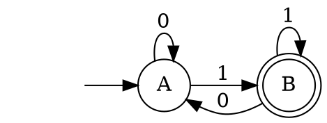
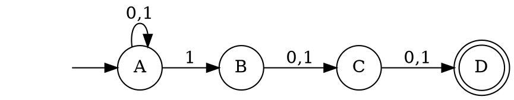
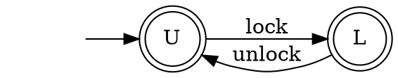
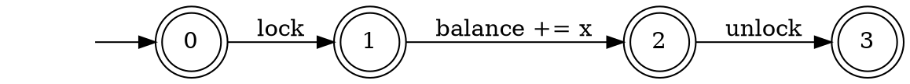
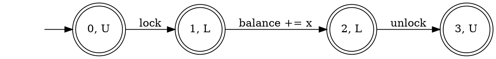
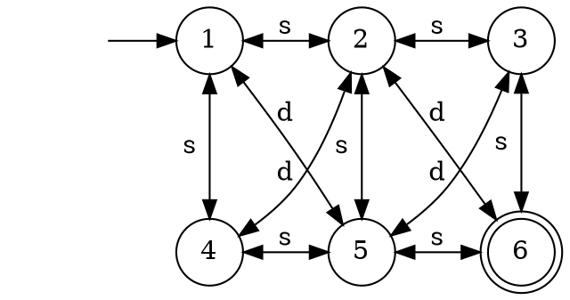
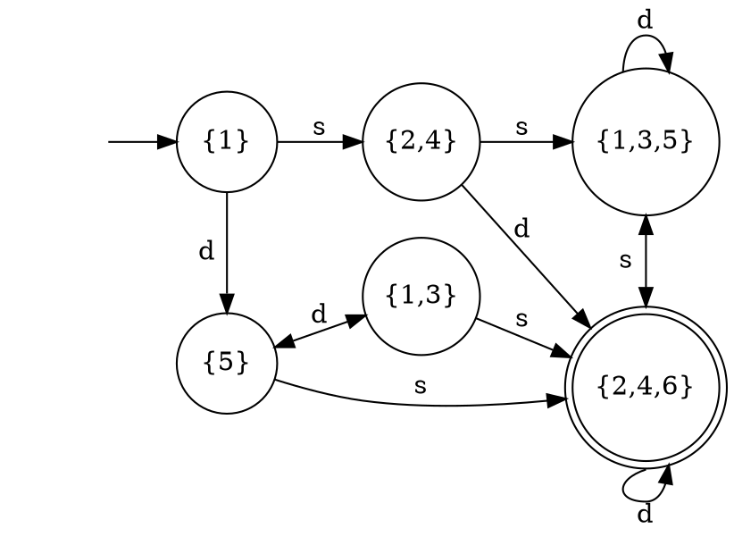

# Finite state machines

## Definitions


#### DFA Example

Words finishing with 1 over the alphabet $\\{0,1\\}$.



_Notation._
* States with double circle are accepting state.
* The state with an arrow coming from nowhere is the initial state.
* In the text, we write state as `(.)`, accepting state as `((.))`, and transition as `→`.

#### DFA

A _deterministic finite automaton_ (DFA) $M$ is a 5-tuple $(Q, Σ, δ, q_0, F)$ where

* $Q$ is a finite set of states
* $Σ$ is a finite alphabet (set of input symbols)
* $δ$ is the transition function ($Q × Σ → Q$)
* $q_0$ is the initial state ($q_0 ∈ Q$)
* $F$ is the set of accepting states ($F ⊆ Q$)

Let $w = a_1 a_2 … a_n$ be a word over the alphabet $Σ$.
The automaton $M$ accepts $w$ if there is a sequence of states, $r_0 r_1 … r_n$, such that:
* $r_0 = q_0$
* $r_{i+1} = δ(r_i, a_{i+1})$ for $i = 0, …, n−1$
* $r_n ∈ F$


#### NFA Example

Word with 1 as the 3rd symbol before the end



#### NFA

A _non-deterministic finite automaton_ (NFA) $M$ is a 5-tuple $(Q, Σ, δ, q_0, F)$ where

* $Q$ is a finite set of states
* $Σ$ is a finite alphabet (set of input symbols)
* $δ$ is the transition function ($Q × Σ → 2^Q$)
* $q_0$ is the initial state ($q_0 ∈ Q$)
* $F$ is the set of accepting states ($F ⊆ Q$)

Let $w = a_1 a_2 … a_n$ an be a word over the alphabet $Σ$.
The automaton $M$ accepts $w$ if there is a sequence of states, $r_0 r_1 … r_n$, such that:
* $r_0 = q_0$
* $r_{i+1} ∈ δ(r_i, a_{i+1})$ for $i = 0, …, n−1$
* $r_n ∈ F$

#### Language

The _language_ of an automaton $M$, denoted $L(M)$, is the set of words accepted by $M$.

#### Trace

A _trace_ of an automaton $M$ is an alternating sequence $r_0 a_1 r_1 a_2 … a_n r_n$ such that
* $r_0 = q_0$
* $r_{i+1} ∈ δ(r_i, a_{i+1})$ for $i = 0, …, n−1$

A trace is _accepting_ if $r_n ∈ F$.


## Operation (Closure properties)

* intersection/union
* complementation
* emptiness/universality

_Remark._
The intersection and union are defined for automata with the same alphabet.
Complementation preserves the alphabet.

_Remark._
Intersection and union are computed with a product construction.
Complementation is easy for DFA but hard for NFA.
Emptiness and universality are solved by minimizing the automaton.


### Synchronized Product

Given automaton $M_1$ and $M_2$, the synchronized product $M_1 ⊗ M_2$ is the automaton $M$ where:

* $Q = Q_1 × Q_2$
* $Σ = Σ_1 ∪ Σ_2$
* $δ$ is the transition function
  - $δ((q_1,q_2), a) = (δ_1(q_1, a), δ_2(q_2, a))$ if $a ∈ Σ_1$ and $a ∈ Σ_2$
  - $δ((q_1,q_2), a) = (q_1, δ_2(q_2, a))$ if $a ∉ Σ_1$ and $a ∈ Σ_2$
  - $δ((q_1,q_2), a) = (δ_1(q_1, a), q_2))$ if $a ∈ Σ_1$ and $a ∉ Σ_2$
* $q₀ = (q₀_1,q₀_2)$
* $F = F_1 × F_2$


#### Example

Here the accepting states describe executions allowed by the program/lock.

**NFA representing a lock**



**Program using a lock**
```c
int balance;

void increase(int x) {
    lock();
    balance += x;
    unlock();
}
```

**Control-flow automaton (CFA)**



A CFA is an automaton which states are control locations of the program and the edges are statments of the program.
It is called CFA because it only captures the part of the state related to the control flow and ignores the values of the variables.


**Synchronized Product**



This is the _lazy_ construction that only constructs state if needed.
The full construction would generate extra states: `((0, L))`, `((1, U))`, `((2, U))`, `((3, L))`.


### Determinization (Powerset construction)

_Assuming no ε-transitions_

Given a NFA $N$ we construct a DFA $D$ with:
* $Q_D = 2_{Q_N}$
* $Σ_D = Σ_N$
* $δ_D(q_D, a) = \bigcup_{q∈q_D} δ_N(q, a) = \\{ q' ~|~ ∃ q ∈ q_D. q' ∈ δ_N(q, a) \\}$
* $q_0^D = \\{ q_0^N \\} $
* $F_D = \\{ q ~|~ q ∩ F_N ≠ ∅ \\}$

_Notation._
We use $N$, $D$ as sub- or superscript to identify wether the element belongs to $N$ or $D$.

__Theorem.__ $L(N) = L(D)$

_Proof._

In two steps:
1. $w ∈ L(N) ⇒ w ∈ L(D)$
2. $w ∈ L(D) ⇒ w ∈ L(N)$

__(1)__ $w ∈ L(N) ⇒ w ∈ L(D)$
* Let $t_N$ be an accepting trace of $N$ for $w$.
  $t_N$ exists by definition of $L(N)$.
* Let $t_D$ be the trace of $w$ on $D$.
  We show that $t_D$ "contains" $t_N$ by induction on the traces:
  - $0$:
    + $q_0^N ∈ \\{ q_0^N \\} = q_0^D$ by definition,
  - $i$ → $i+1$:
    + by induction hypothesis: $r_i^N ∈ r_i^D$
    + by definition of $t_N$ and $δ_D$: $r_{i+1}^N ∈ δ_N(r_i^N, a_i)$ and, therefore, $r_{i+1}^n ∈ r_{i+1}^D$.
* By hypothesis, the last state of $t_N$ is $q_n^N$ with $q_n^N ∈ F_N$.
* By the above, we have $q_n^N ∈ q_n^D$.
* Therefore, $q_n^D ∩ F_N ≠ ∅$.
* Thus, $t_D$ is accepting.

__(2)__ $w ∈ L(D) ⇒ w ∈ L(N)$
* As homework …

##### Example of Determinization

Let the following NFA where it is possible to more `s`traight or `d`iagonally:



Determinizing it gives:



## Additional References

If you need a deeper refresher or want to learn more about automata theory.
I recommend the following two books:
* Introduction to the Theory of Computation by Michael Sipser
* Introduction to Automata Theory, Languages, and Computation by John Hopcroft and Jeffrey Ullman
