# Verifying Properties of Systems

### Properties

Properties of concurrent systems are broadly divided in two categories:
* _Safety_: properties that are violated by finite traces
* _Liveness_: properties that can only be violated by infinite traces

In this class we focus on _safety_ properties and a few _eventuality_ properties.
Eventuality properties are simple liveness properties that says something eventually happens, e.g., a program eventually terminates.
General classes of temporal properties (LTL, CTL, μ-calculus, weak/strong fairness, …) are out of scope.

#### Example

* Assertion is a safety property.
* Termination is a liveness property.
* Termination within 15 steps is a safety property.
* Deadlock-freedom is a safety property.
* Livelock-freedom is a liveness property.


## Verification

As Paths in graphs:
- Safety is reachability: path from the initial state to an error state.
- Eventuality is nested reachability: lasso path with the stem starting at the initial state and the loop does not go to any "progress" state where the progress state are the states that should eventually happen.

Verification can be done as automata construction.
Let us assume we have a program $A$ and a safety property $B$ represented as automata with the same alphabet $Σ$.
The program satisfy the property is a language inclusion check: $L(A) ⊆ L(B)$ which reduces to $L(A) ∩ (Σ^*∖L(B)) = L(A) ∩ L(¬B) = ∅$.

Instead doing the check $L(A) ∩ L(¬B) = ∅$ on the language (potentially infinite sets), we can to it on the automata as $A ⊗ ¬B = ∅$.
This formulation also work when $A$ and $B$ have different alphabets.


#### Example

Using the lock+program above, we can check that the program uses the lock correctly.

First, we complement the lock:

We can also add the error state to the automaton representing the program and, then, take the product.

The product is show below.
The colors represent the following:
* In blue, we show the "expected" reachable states.
* In black, we show the remaining reachable states.
* In grey, we show the unreachable states.
Notice that, no accepting state is reachable and, therefore, the program is safe.


### State-space Exploration (Model Checking)

Checking safety properties reduces to an emptiness check, we need to find an accepting path.
Since we negate the property to check, an accepting path is a counterexample!

Basic algorithm for checking safety properties:

```c
F := {q₀}    // frontier
V := {}      // visited
while F ≠ ∅  do
    choose s in F
    F := F ∖ {s}
    if s ∉ V
        V := V ∪ {s}
        if ¬safe(s)
            return UNSAFE
        else
            F := F ∪ {s′ | δ(s,s′)}
return SAFE
```
The algorithm above has a complexity of $O(|Q|⋅|Σ|)$.

Variations:
* using a queue for F makes a BFS
* using a stack for F makes a DFS
* this is a forward search, it is also possible do a backward search (start from the error state and computes the predecessors)


#### Encoding data as automaton

We can encode _bounded_ datatypes as finite automaton:
* boolean value `b`
    ```graphviz
    digraph finite_state_machine {
        rankdir=LR;
        node [shape = doublecircle];
        init [shape = none, label = ""];
        init -> false;
        false -> false [ label = "b = false" ];
        false -> true [ label = "b = true" ];
        true -> false [ label = "b = false" ];
        true -> true [ label = "b = true" ];
    }
    ```
* integer `i`
    ```graphviz
    digraph finite_state_machine {
        rankdir=LR;
        node [shape = doublecircle]; 0; 1;
        m1 [ label = "-1"];
        node [shape = none, label = ""]; init; dummy0; dummy1;
        mdots [shape = none, label = "..."];
        dots [shape = none, label = "..."];
        mdots -> m1 [style=invis];
        m1 -> 0 [label = "i += 1"];
        0 -> 1 [label = "i += 1"];
        1 -> dots  [style=invis];
        dummy0 -> dummy1  [style=invis];
        dummy1 -> init  [style=invis];
        edge [constraint = false];
        init -> 0;
        0 -> m1 [label = "i -= 1"];
        1 -> 0 [label = "i -= 1"];
    }
    ```

However, this is very expensive.
Numbers are exponentially more succinct than automaton.

# Petri Nets

Petri nets are an important generalization of finite state machines with a restricted form of counting.
Given multiple instances of the same finite state machine, rather than taking the product, we just "count" how many copies are in a given state.

You can find more detailed definitions and complete explanations in the [lecture notes by Roland Meyer](https://www.tcs.cs.tu-bs.de/documents/ConcurrencyTheory_WS_20112012/lecture_notes.pdf).
We cover the following parts:
* 1.1 Syntax and Semantics
* 2.1 Marking Equations
* 2.4 Verification by Linear Programming

---

__Clarification about "safe".__

Unfortunately, the term safe is overloaded in the context of Petri Net. It can mean:
1. safe = 1-bounded
2. safe as satisfies a safety (reachability) property.

In particular, the part about verification using LP is about the 2nd meaning.

---

#### Example Petri Net

__(A)__ A simple Petri Net with 2 places and 1 transition:

```graphviz
digraph PN {
	rankdir=LR;
    node [shape = circle, fixedsize = true, width = 0.5];
    p1 [ label="∙", fontsize = 24 ];
    p2 [ label="" ];
    node [shape = box, label = "", style = filled, fillcolor = black, fixedsize = true, width = 0.15];  t1;
    p1 -> t1;
    t1 -> p2;
}
```


_Notations._
- An large circle represents a place and a smaller dots inside the circle represent a token.
  Places can have more than one token.
  For instance, 2 an 3 tokens;
    ```graphviz
    digraph PN {
        rankdir=LR;
        node [shape = circle, fixedsize = true, width = 0.5, fontsize = 30 ];
        p1 [ label=":"];
        p2 [ label="⫶"];
        edge [ style = invis];
        p1 -> p2;
    }
    ```
- A black rectangle is a transition.
  Transitions can also be written as vertical bars, horizontal bars, or squares depending on the layout.
- The arrows between places and transitions indicates how many tokens a transition consumes/produces.
  Transition can consume and produce more than 1 token per place.
  In such cases, the edge is labeled by the number of tokens.

Transition consumes token on their incoming arrows and produce tokens on their outgoing arrow.
In this example, firing the transition produces:

```graphviz
digraph PN {
	rankdir=LR;
    node [shape = circle, fixedsize = true, width = 0.5, fontsize = 24];
    p1 [ label="" ];
    p2 [ label="∙" ];
    node [shape = box, label = "", style = filled, fillcolor = black, fixedsize = true, width = 0.15];  t1;
    p1 -> t1;
    t1 -> p2;
}
```


__(B)__ A more interesting Petri Net with 2 places and 2 transition:

```graphviz
digraph PN {
	rankdir=LR;
    node [shape = circle, fixedsize = true, width = 0.5, fontsize = 24];
    p1 [ label="∙"];
    p2 [ label="" ];
    node [shape = box, label = "", style = filled, fillcolor = black, fixedsize = true, width = 0.15];  t1, t2;
    t2 -> p1;
    p1 -> t1;
    t1 -> p2;
}
```

Now we have the choice between two transitions:

```graphviz
digraph PN {
	rankdir=LR;
    node [shape = circle, fixedsize = true, width = 0.5, fontsize = 24];
    p1 [ label="" ];
    p2 [ label="∙" ];
    node [shape = box, label = "", style = filled, fillcolor = black, fixedsize = true, width = 0.15];  t1, t2;
    t2 -> p1;
    p1 -> t1;
    t1 -> p2;
}
```

or


## Definitions

### Petri Net Syntax

A _Petri Net_ $N$ is a triple $(S, T, W)$ where
* $S$ is a finite set of places
* $T$ is a finite set of transitions
* $W$ is a weight function over $(S × T) ∪ (T × S) → ℕ$

A _marking_ of $N$ is a function $M: S → ℕ$.

A _marked Petri Net_ is the pair $(N,M₀)$ where $N$ is a Petri Net and $M₀$ is the initial making.
We also write it as $(S, T, W, M₀)$.

In the rest of this document, we assume that $N = (S,T,W,M₀)$ is a marked Petri net.

#### Example

The example (A) corresponds to:
* $S = \\{p, q\\}$ where  $p$ is the left place and $q$ is the right place
* $T = \\{t\\}$
* $W$ is
  - $W(p,t) = 1$
  - $W(q,t) = 0$
  - $W(t,p) = 0$
  - $W(t,q) = 1$
* $M₀$ is $[p →  1, q → 0]$.


### Petri Net Semantics

A transition $t$ in $(S,T,W)$ with marking $M$ is _enabled_ iff $∀ s ∈ S. M(s) ≥ W(s,t)$.

If no transition is enabled at $M$ then it is a _deadlock_.

An enabled transition $t$ can _fire_ and produce a new marking $M'$, such that, $∀ s ∈ S. M'(s) = M(s) - W(s,t) + W(t,s)$.

Transitions induce a _firing relation_ which contain triples $(M₁,t,M₂)$ iff
- $t$ is enabled in $M₁$ and
- $M₂$ is obtain by firing $t$ at $M₁$.
The firing relation is usually written $M₁ [t〉 M₂$.

The set of _reachable markings_ is $R(M₁) = \\{ M₂ ~|~ ∃ π ∈ T^*. M₁ [π〉 M₂ \\}$.
We use $R(N)$ for $R(M₀)$.

The _reachability graph_ $R(N)$ is the graph where
- there is a node for every marking in $R(N)$ and
- the edges is the firing relation restricted to $R(N)$.

#### Example

In the example (A), after firing the transition we obtain the new marking $M' = [p → 0, q → 1]$.
$M'$ is a deadlock.
The reachability graph of (A) has two nodes.

In the example (B), the reachability graph is infinite.

#### Example (revisiting `lock-increment-unlock`)

Let look back at the "lock and increment" example from [the first week](viewer.html?md=concurrency_theory_2018/notes_1.md).

1. The corresponding Petri Net is:
  * $S = \\{U, L, 0, 1, 2, 3\\}$
  * $T = \\{\texttt{lock}, \texttt{unlock}, \texttt{balance += x}\\}$
  * $W$:
    - $W(U, \texttt{lock}) = 1$, $W(0, \texttt{lock}) = 1$, $W(\texttt{lock}, L) = 1$, $W(\texttt{lock}, 1) = 1$,
    - $W(1, \texttt{balance += x}) = 1$, $W(\texttt{balance += x}, 2) = 1$
    - $W(L, \texttt{unlock}) = 1$, $W(2, \texttt{unlock}) = 1$, $W(\texttt{unlock}, U) = 1$, $W(\texttt{unlock}, 3) = 1$,
    - otherwise $0$
  * $M₀ = [U → 1, L → 0, 0 → 1, 1 → 0, 2 → 0, 3 → 0]$
  ```graphviz
  digraph PN {
      rankdir=LR;
      node [shape = circle, fixedsize = true, width = 0.5];
      p1 [ xlabel="U", label="∙" ];
      p2 [ xlabel="L", label="" ];
      p3 [ xlabel="0", label="∙" ];
      p4 [ xlabel="1", label="" ];
      p5 [ xlabel="2", label="" ];
      p6 [ xlabel="3", label="" ];
      node [shape = box, label = "", style = filled, fillcolor = black, fixedsize = true, width = 0.15];
      t1 [xlabel="lock" ];
      t2 [xlabel="unlock" ];
      t3 [xlabel="balance += x" ];
      p1 -> t1 [ constraint = false ];
      p3 -> t1;
      t1 -> p2;
      t1 -> p4;
      p4 -> t3;
      t3 -> p5;
      p2 -> t2;
      p5 -> t2;
      t2 -> p1 [ constraint = false ];
      t2 -> p6;
      p3 -> p1 [ style = invis];
  }
  ```
2. We can add more "increment" programs by adding more places and transitions.
  * $S = \\{U, L, A0, A1, A2, A3, B0, B1, B2, B3\\}$
  * $T = \\{\text{A:}\texttt{lock}, \text{A:}\texttt{unlock}, \text{B:}\texttt{lock}, \text{B:}\texttt{unlock}, \text{A:}\texttt{balance += x}, \text{B:}\texttt{balance += x}\\}$
  * $W$ with $\text{X} ∈ \\{\text{A},\text{B}\\}$:
    - $W(U, \text{X:}\texttt{lock}) = 1$, $W(X0, \text{X:}\texttt{lock}) = 1$, $W(\text{X:}\texttt{lock}, L) = 1$, $W(\text{X:}\texttt{lock}, 1) = 1$ 
    - $W(X1, \text{X:}\texttt{balance += x}) = 1$, $W(\text{X:}\texttt{balance += x}, X2) = 1$
    - $W(L, \text{X:}\texttt{unlock}) = 1$, $W(X2, \text{X:}\texttt{unlock}) = 1$, $W(\text{X:}\texttt{unlock}, U) = 1$, $W(\text{X:}\texttt{unlock}, X3) = 1$
    - otherwise $0$
  * $M₀ = [U → 1, A0 → 1, B0 → 1, \\_ → 0]$
  ```graphviz
  digraph PN {
      rankdir=LR;
      node [shape = circle, fixedsize = true, width = 0.5];
      p1 [ xlabel="U", label="∙" ];
      p2 [ xlabel="L", label="" ];
      ap3 [ xlabel="A0", label="∙" ];
      ap4 [ xlabel="A1", label="" ];
      ap5 [ xlabel="A2", label="" ];
      ap6 [ xlabel="A3", label="" ];
      bp3 [ xlabel="B0", label="∙" ];
      bp4 [ xlabel="B1", label="" ];
      bp5 [ xlabel="B2", label="" ];
      bp6 [ xlabel="B3", label="" ];
      node [shape = box, label = "", style = filled, fillcolor = black, fixedsize = true, width = 0.15];
      at1 [xlabel="A:lock" ];
      at2 [xlabel="A:unlock" ];
      at3 [xlabel="A:balance += x" ];
      bt1 [xlabel="B:lock" ];
      bt2 [xlabel="B:unlock" ];
      bt3 [xlabel="B:balance += x" ];
      p1 -> at1 [ constraint = false ];
      ap3 -> at1;
      at1 -> p2;
      at1 -> ap4;
      ap4 -> at3;
      at3 -> ap5;
      p2 -> at2;
      ap5 -> at2;
      at2 -> p1 [ constraint = false ];
      at2 -> ap6;
      ap3 -> p1 [ style = invis];
      p1 -> bt1 [ constraint = false ];
      bp3 -> bt1;
      bt1 -> p2;
      bt1 -> bp4;
      bp4 -> bt3;
      bt3 -> bp5;
      p2 -> bt2;
      bp5 -> bt2;
      bt2 -> p1 [ constraint = false ];
      bt2 -> bp6;
      bp3 -> p1 [ style = invis];
  }
  ```
3. Or we can add more "increment" programs by adding more tokens: $M₀(0) = 2$ for $2$ threads.
  ```graphviz
  digraph PN {
      rankdir=LR;
      node [shape = circle, fixedsize = true, width = 0.5];
      p1 [ xlabel="U", label="∙" ];
      p2 [ xlabel="L", label="" ];
      p3 [ xlabel="0", label=":" ];
      p4 [ xlabel="1", label="" ];
      p5 [ xlabel="2", label="" ];
      p6 [ xlabel="3", label="" ];
      node [shape = box, label = "", style = filled, fillcolor = black, fixedsize = true, width = 0.15];
      t1 [xlabel="lock" ];
      t2 [xlabel="unlock" ];
      t3 [xlabel="balance += x" ];
      p1 -> t1 [ constraint = false ];
      p3 -> t1;
      t1 -> p2;
      t1 -> p4;
      p4 -> t3;
      t3 -> p5;
      p2 -> t2;
      p5 -> t2;
      t2 -> p1 [ constraint = false ];
      t2 -> p6;
      p3 -> p1 [ style = invis];
  }
  ```
4. We can even add many more threads by adding a transition $spawn$ with: $M(spawn, 0) = 1$.
  ```graphviz
  digraph PN {
      rankdir=LR;
      node [shape = circle, fixedsize = true, width = 0.5];
      p1 [ xlabel="U", label="∙" ];
      p2 [ xlabel="L", label="" ];
      p3 [ xlabel="0", label="" ];
      p4 [ xlabel="1", label="" ];
      p5 [ xlabel="2", label="" ];
      p6 [ xlabel="3", label="" ];
      node [shape = box, label = "", style = filled, fillcolor = black, fixedsize = true, width = 0.15];
      t1 [xlabel="lock" ];
      t2 [xlabel="unlock" ];
      t3 [xlabel="balance += x" ];
      t4 [xlabel="spawn" ];
      t4 -> p3;
      p1 -> t1 [ constraint = false ];
      p3 -> t1;
      t1 -> p2;
      t1 -> p4;
      p4 -> t3;
      t3 -> p5;
      p2 -> t2;
      p5 -> t2;
      t2 -> p1 [ constraint = false ];
      t2 -> p6;
      p3 -> p1 [ style = invis];
  }
  ```


## Properties

Between this week and next week we will discuss the following questions:

* _Reachability_: Is a marking $M$ reachable? Is there a sequence of transitions $t₁ t₂ … t_n$ such that $M₀ [t₁〉 M₁ [t₂〉 M₂ … [t_n〉 M$?
* _Coverability_: Is it possible to cover $M$, i.e., reach a marking $M'$ such that $M' ≥ M$?
* _Boundedness_: Is there a bound $k$ such that for all reachable marking $M$ and state $s$ the number of tokens is bounded by $k$ ($|M(s)| ≤ k$) ?
* _Termination_: Is there an infinite firing sequence starting at $M₀$?

#### Example

_Reachability._
Let us look at mutual exclusion in the Petri Net (1-4).
Mutual exclusion is violated if it is possible to reach a marking in:
1. $\\{ M ~|~ M(2) = 2 \\}$
2. $\\{ M ~|~ M(A2) + M(B2) = 2 \\}$
3. same as (1)
4. same as (1)

_Coverability._
We can relax the property above to any number more than $1$: $\\{ M ~|~ M(2) > 1 \\}$.
Coverability is reachability in "upward-closed" sets.
More on that next week.

_Boundedness._
* (A) is 1-bounded, also called safe, and (B) is unbounded.
* (1) and (2) are safe, (3) is 2-bounded, (4) is unbounded.

Termination.
* (A) terminates
* (B) does not terminate.


### Analysis of Petri Nets using Linear Programming

We will now discuss a _sound but incomplete_ method for the reachability problem.

_Remark._
Given a verification question of the form: "Is program P correct?"
* A _sound_ method returns "yes" _only if_ P is correct.
* A _complete_ method returns "yes" _if_ P is correct.

Sound methods can fail to correctly classify correct programs.
Complete methods can fail to correctly classify incorrect programs.

_Caveat._
Often the question "is a program correct?" is exchanged with "is there a bug?".
This change the meaning of _false positive/negative_.
"Is there a bug?" is the De Facto interpretation:
- _false positive/alarm_: a correct program is marked as incorrect.
- _false negative_: an incorrect program is marked as correct.

### Marking Equations

Let $n = |S|$ be the number of places and $m = |T|$ be the number of transitions.

If we order the places in $S$.
We can represent states as vector in $ℕ^n$.

We can also represents the transitions as vectors that get added or subtracted from the current vector.
For a given transition $t$, we have:
* Forward vector:
    $
    W(\\_, t) = \begin{bmatrix}
                  W(s₁, t)  \\\\
                  ⫶         \\\\
                  W(s_n, t)
                \end{bmatrix}
    $
* Backward vector:
    $
    W(t, \\_) = \begin{bmatrix}
                  W(t, s₁)  \\\\
                  ⫶         \\\\
                  W(t, s_n)
                \end{bmatrix}
    $

Putting the transitions together gives matrices:
* Forward matrix:       $F = [W(\\_ , t₁) … W(\\_ , t_m)]$
* Backward matrix:      $B = [W(t₁, \\_ ) … W(t_m, \\_ )]$
* Connectivity matrix:  $C = B - F$

#### Examples

The connectivity matrix of (A) is $\begin{bmatrix} -1 \\\\ 1 \end{bmatrix}$.

The connectivity matrix of (B) is $\begin{bmatrix} 1 & -1 \\\\ 0 & 1 \end{bmatrix}$.

### Co-linear Properties

We can think about reachability/safety properties as function from $ℕ^n → 𝔹$ that returns true if the properties hold in a given marking.

A property is _co-linear_ if its _violation_ can be expressed by a linear inequality $A⋅M ≥ B$.

#### Example

The reachability and coverability examples above are co-linear.

For instance, we can rewrite $\\{ M ~|~ M(2) > 1 \\}$ as:
```
  U L 0 1 2 3
[ 0 0 0 0 1 0 ] ∙ M ≥ [ 2 ]
```


### LP Verification System

Given a Petri Net $N = (S,T,W,M₀)$, let
$C$ be the connectivity matrix,
$A⋅M ≥ B$ a co-linear property, and
$X$ is a vector of size $|T|$.

$X$ represents the number of time each transition fires.

We can create the following LP program:

---
\\[
\begin{array}{ll}
\text{Variables:}   & M, X \\\\
\text{Subject to:}  & M ≥ 0 \\\\
                    & X ≥ 0 \\\\
                    & M = M₀ + C⋅X \\\\
                    & A⋅M ≥ B 
\end{array}
\\]

---

__Theorem.__
If the LP system above is infeasible then $N$ is safe. (It cannot reach a marking $M$ that satisfies $A⋅M ≥ B$.)

_Proof._
* By contradiction, assume the system is infeasible and $N$ is unsafe.
* If $N$ is unsafe, there is a sequence $π$ of firing such that $M₀ [π〉M$ and $A \cdot M ≥ B$.
* We can take the _Parihk image_ of $π$ and obtain a vector $X$.
  (The Parikh image of a trace $π$ counts how many times each transition occurs in $π$.
  For instance, the Parikh image of $t₁ t₂ t₁$ over $\\{t₁, t₂, t₃\\}$ returns is $\begin{bmatrix} 2 & 1 & 0 \end{bmatrix}$.)
* By definition of $C$, we have that $M = M₀ + C \cdot X$.
* The other conditions of the LP are trivial satisfied and, therefore, it is feasible. (contradiction)

#### Incompleteness 1: ℕ vs ℚ

For $M$ and $X$, we can use rational numbers which makes the check simpler (polynomial time) but less precise or integers which is more precise and also more expensive (NP).

Consider the following Petri Net:

and the property: $M(q) = 1$.
The LP problem can return $X = [ 0.5 ]$ when solving over ℚ.

#### Incompleteness 2: merging forward and backward edges

Consider the following net:

It is deadlocked.

However, because the connectivity matrix merges the forward and backward edges, the LP for this net is that same as for the following net:

This net is not in a deadlock.

#### Incompleteness 3: reconstructing the transition sequence

The last source of inaccuracy is the fact that the LP find the Parikh image of a trace.
To find a real counterexample, we need to turn the transition counts in a sequence of transition.
This is not always possible.
In some sense, the LP is not checking if transitions are enabled.

Consider:

which gives the connectivity matrix:
$\begin{bmatrix} -1 & 1 \\\\
                  2 & -1 \end{bmatrix}$
Given the objective $M = \begin{bmatrix} 0 \\\\ 1 \end{bmatrix}$, the LP gives $X = \begin{bmatrix} 1 \\\\ 1 \end{bmatrix}$.
However, it is not possible to turn $X$ into a trace.
No transition is enabled.


### LP for Termination

We can also use linear programming to show liveness properties of Petri nets. 
Consider the termination problem: is there an infinite sequence of transition which can be fired? 

Before we give a solution, we need to think about what kind of sequence of marking result in an infinite run.
In an automaton, a loop with or leading to an accepting state can generate infinite runs.
We want to find something similar but for markings.

Let us assume we start with a marking $M$ execute a sequence $t$ of transitions which results in the marking $M'$.
We we compare $M$ and $M'$ there can be the following cases:
1. $M = M'$ 
2. $M > M'$ (All the places contain at least as many in $M'$ as in $M$ and one place contains strictly more tokens.)
3. $M < M'$ (All the places contain at most as many in $M'$ as in $M$ and one place contains strictly fewer tokens.)
4. $M ≠ M'$ (None of the above apply: at least one place has more token and at least one other place has fewer token.)

If we have case (1) we can apply $t$ again and not terminate.

If the case (2), we can apply $t$ again and get an ever larger marking.
Since we have more tokens the transitions in $t$ are enabled.
We can repeat that and not terminate.

For (3) and (4), there is at least one place with fewer tokens.
Therefore, we cannot repeat $t$ forever.
At some point the place with fewer tokens will be empty and disable some transition in $t$. 

Therefore, to find a $t$ we can iterate forever we are looking for _non-decreasing_ cycle.

We can encode the presence of non-decreasing cycles in a linear program as follows:

---
\\[
\begin{array}{ll}
\text{Variables:}   & X \\\\
\text{Subject to:}  & X > 0 \\\\
                    & C \cdot X ≥ 0 
\end{array}
\\]

---
Here, $C$ is the connectivity matrix and $X$ is a vector that represent the number of times each transition fires.
We require that $X$ contains at least one transition.
(Otherwise, $X=0$ trivially satisfies the last constraint.)
Finally, $C \cdot X$ is the net result of firing $X$ and we require it to be non-negative, i.e., a non-decreasing cycle.

Notice that the constraints do not talk about the initial marking.
So, the method is sound and not complete w.r.t. to an initial marking.
For instance, consider following net:

It has terminated (no transition can fire).
But it cannot be proved using the linear program.

The incompleteness of the analysis stems from the fact that the LP can have a negative number of token during the firing of the non-decreasing cycle.
The LP only relates the start and end marking.
It does not say anything about the intermediate marking.

However, if we are allowed to pick then the analysis is also complete.
We can always pick an initial marking with enough tokens such that every transition in the non-decreasing cycle can be fired.
Given a non-decreasing cycle, we create an initial marking which corresponds to the sum of all the token consumed during the cycle.
Therefore, we can apply the transition at least once and, because the cycle is non-decreasing, we end up with at least as many token.
