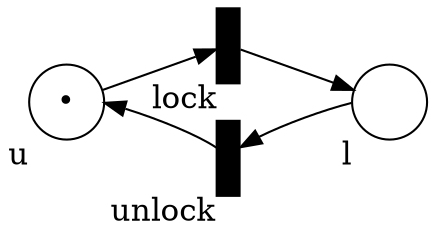
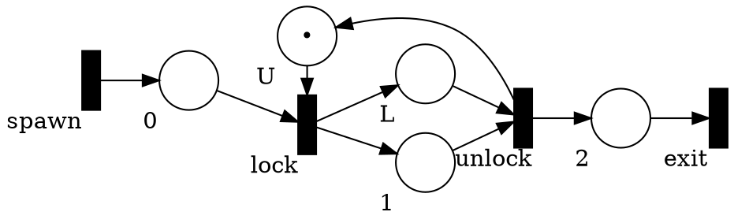
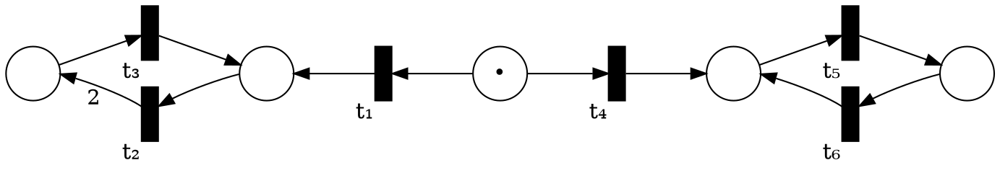

# Petri Nets Continued...

_Assumptions._
For this part, we assume a non-trivial connected Petri Net $N = (S,T,W,M₀)$,
$C$ is the connectivity matrix,
$n = |S| ≥ 1$, and
$m = |T| ≥ 1$.

_Non-trivial net._
A Petri net is _non-trivial_ iff there is at least one place and one transition.

_Connected net._
A Petri net is _connected_ iff the graph defined by $W$ has a single connected component.

These two assumptions are needed otherwise some elements like the connectivity matrix are ill-defined and some results do not hold.
Trivial nets are easy to analyze on their own and for the case of _not_ connected nets it is possible to analyze the connected components separately.


## Structural properties

For the structural properties of Petri nets, you can find more detailed definitions and complete explanations in the [lecture notes by Roland Meyer](https://www.tcs.cs.tu-bs.de/documents/ConcurrencyTheory_WS_20112012/lecture_notes.pdf):
* 2.2 Invariants


### Invariants

An _invariant_ is a predicate which is true for any reachable state of a Petri net.

An invariant must be preserved by all the transitions in the net.
(Assuming every transition fires at least once.)

### Structural invariants

An invariant is _structural_ iff it can be expressed as vector in $I ∈ ℚ^n$ and $I^T \cdot C = 0$ (note that here $0 \in Q^m$).

$I$ is a vector of coefficients for each place such that the transition $M [〉 M'$ preserves the number of tokens with $I$ as weights: $I^T \cdot M = I^T \cdot M' $.

#### Example

Let us consider the lock example:


With
$
C = \begin{bmatrix} -1 &  1 \\\\ 1 &-1 \end{bmatrix}
$

$I^T = \begin{bmatrix}1 \\\\ 1\end{bmatrix}$ is a structural invariant.
For any reachable $M$, we have $M(u) + M(l) = I^T \cdot M₀ = 1$.

__Theorem.__
Let $I$ be a structural invariant of $N$.
For any reachable marking $M ∈ R(M₀)$, $I^T \cdot M = I^T \cdot M₀$.

_Proof._
* Let $\pi$ be the trace from $M₀$ to $M$, i.e., $M₀ [π〉M$.
* We have that $M = M₀ + C \cdot \mathit{Parikh}(\pi)$.
* Multiplying both sides by $I^T$ gives $I^T \cdot M = I^T \cdot (M₀ + C\cdot \mathit{Parikh}(\pi))$.
* Distributing $\cdot$ over $+$ gives $I^T \cdot M = I^T \cdot M₀ + I^T \cdot C\cdot \mathit{Parikh}(\pi)$.
* By definition of $I$, we have $I^T \cdot C = 0$ and, thus, $I^T \cdot C\cdot \mathit{Parikh}(\pi) = 0$.
* This simplifies the equation to $I^T\cdot M = I^T\cdot M₀$.

__Corollary.__
If $I$ is a structural invariant of $N$, $M$ a marking of $N$, and $I^T \cdot M \neq I^T \cdot M_0$, then $M$ is not reachable.

#### Example

Let consider a sightly simplified version of our running example:


With the ordering on the places be $(U, L, 0, 1, 2)$, and the ordering on transitions $(\mathit{lock}, \mathit{unlock}, \mathit{spawn}, \mathit{exit})$, we have

$C =
\begin{bmatrix}
-1 & 1 & 0 & 0 \\\\
1 & -1 & 0 & 0 \\\\
-1 & 0 & 1 & 0 \\\\
1 & -1 & 0 & 0 \\\\
0 & 1 & 0 & -1
\end{bmatrix}$

$I^T = \begin{bmatrix}1 & 0 & 0 & 1 & 0\end{bmatrix}$ is a structural invariant and we have that $I^T\cdot M₀ = 1$.

We can use that to conclude that there is at most 1 token in place $1$ and, therefore, mutual exclusion is preserved.


## Monotonicity

Until now, we only saw sufficient but not necessary conditions to check properties of Petri nets.
We will now introduce some complete procedure for termination, boundedness, and termination.

### Ordering on markings

- $N ≥ M$ iff $∀ s.\ N(s) ≥ M(s)$
- $N > M$ iff $∀ s.\ N(s) ≥ M(s) ∧ ∃ s.\ N(s) > M(s)$

$\geq$ is not a total order.
For instance, $(0,1)$ and $(1,0)$ are not comparable.

### Definition of monotonicity

_Observation._
Consider $M [t〉 M'$ and $N \geq M$.
$t$ is also enabled at $N$ and, if we fire $t$, we get $N [t〉 N'$ with $N' ≥ M'$.

__Theorem.__
$M [t〉M'  ⇒  (M+N) [t〉 (M'+N)$


More abstractly, monotonicity is usually represented using the following illustration:
```
∀ M, M′, N.    M  ≤  N
∃ N′.          ↓     ↓
               M′ ≤  N′
```
Put differently, $\leq$ is a simulation relation.
Larger states can simulate smaller ones.
By "simulate", we mean can take the same transitions (and maybe even more).


### Finite reachability tree

Algorithm to decide if a Petri net always terminates:

```c
TerminationCheck(S,T,W,M₀)
    F := {M₀}    // frontier
    E := {}      // edges in the reachability tree
    while F ≠ ∅  do
        choose M in F
        F := F ∖ {M}
        ancestors := { A | A can reach M in E }
        if ∃ A ∈ ancestors. A ≤ M
            return NON-TERMINATING
        else
            for each t ∈ T with t enabled at M and M′ such that M [t〉 M′
                E := E ∪ { (M,t,M′) }
                F := F ∪ M′
    return TERMINATING
```

#### Example

Consider the following net:

We order the state from left to right.
For conciseness, we write vector horizontally.
For instance, the initial state is `(0 0 1 0 0)`.

Let us call the transitions:
* `t₁ = ( 0  1 -1  0  0)`
* `t₂ = ( 2 -1  0  0  0)`
* `t₃ = (-1  1  0  0  0)`
* `t₄ = ( 0  0 -1  1  0)`
* `t₅ = ( 0  0  0 -1  1)`
* `t₆ = ( 0  0  0  1 -1)`

Applying the algorithm gives:
```
            ↗ (0 0 0 1 0) → (0 0 0 0 1) → (0 0 0 1 0) NON-TERMINATING with t₄ (t₅ t₆)*
(0 0 1 0 0)
            ↘ (0 1 0 0 0) → (2 0 0 0 0)
```

#### Claims

* `TerminationCheck` terminates
* When `TerminationCheck` returns `NON-TERMINATING` we can extract a lasso-shaped trace where the stem starts from `M₀` and the loop is a non-decreasing cycle.
* When `TerminationCheck` returns `TERMINATING` we can extract a finite tree which contains all the reachable states.

Let us look in more details at the first one:
* If the algorithm does not terminate we have an infinite sequence of markings $\mathcal{M}$ such that $∀ i, j.\ i ≤ j ⇒ \mathcal{M}[i] > \mathcal{M}[j] ∨ \mathcal{M}[i] ~\text{incomparable with}~ \mathcal{M}[j]$.
* This is not possible if
  1. there is no infinite decreasing chain, and
  2. there is no infinite antichain (sequence where all the elements are incomparable).
* In a decreasing chain, at each step at least one of the places must have less token. Since we have a finite number of places and we cannot have negative token, it is not possible to decrease forever.
* In an antichain, all the states are incomparable... next week when we discuss well-quasi-order this will follow easily.


### Boundedness

The Petri net are strictly monotonic:
```
∀ M, M′, N.    M  <  N
∃ N′.          ↓     ↓
               M′ <  N′
```
and we can modify the algorithm to decide boundedness.

```c
BoundednessCheck(S,T,W,M₀)
    F := {M₀}    // frontier
    E := {}      // edges in the reachability tree
    while F ≠ ∅  do
        choose M in F
        F := F ∖ {M}
        ancestors := { A | A can reach M in E }
        if ∃ A ∈ ancestors. A < M
            return UNBOUNDED
        else if ∃ A ∈ ancestors. A = M
            skip
        else
            for each t ∈ T with t enabled at M and M′ such that M [t〉 M′
                E := E ∪ { (M,t,M′) }
                F := F ∪ M′
    return BOUNDED
```

#### Example

Applying the algorithm gives:
```
            ↗ (0 0 0 1 0) → (0 0 0 0 1) → (0 0 0 1 0)
(0 0 1 0 0)
            ↘ (0 1 0 0 0) → (2 0 0 0 0) → (1 1 0 0 0) UNBOUNDED with t₁ (t₂ t₃)*
```

#### Claims

* `BoundednessCheck` terminates
* When `BoundednessCheck` returns `UNBOUNDED` we can extract extract a lasso-shaped trace where the stem starts from `M₀` and an increasing cycle.

### Karp-Miller tree

Let us generalize the algorithms above to decide coverability.

We need to introduce a _limit element_ $ω$ that represent an "unbounded" number of tokens.
$ω$ has the following properties:
* $ω = ω$, $ω = ω+1$, $ω = ω-1$
* $ω > n$ for any finite $n$

We can also extend markings to _generalized markings_ which are function from $S → ℕ ∪ \\{ω\\}$.


_Acceleration._
Given $M$ and $M'$ with $M' > M$, we return $M″$ such that:
* $M″(s) = M(s)$ if $M(s) = M'(s)$
* $M″(s) = ω$ if $M'(s) > M(s)$


```c
KarpMillerTree(S,T,W,M₀)
    F := {M₀}    // frontier
    E := {}      // edges in the reachability tree
    while F ≠ ∅  do
        choose M in F
        F := F ∖ {M}
        for each t ∈ T with t enabled at M and M′ such that M [t〉 M′
            ancestors :=  { A | A can reach M in E } ∪ M
            M′ := accelerate(ancestors, M′)
            E := E ∪ { (M,M′) }
            if ∀ A ∈ ancestors. not(A ≥ M′) 
                F := F ∪ {M′}
    return E

accelerate(ancestors, M)
    while ∃ A ∈ ancestors. A < M ∧ accelerate1(A, M) ≠ M do
        M := accelerate1(A, M)
    return M

accelerate1(M₁, M₂)
    M := empty marking
    for (s ∈ S))
        if (M₁(s) < M₂(s))
            M(s) := ω
        else
            M(s) := M₂(s)
    return M
```

#### Example

Applying the algorithm gives:
```
            ↗ (0 0 0 1 0) → (0 0 0 0 1) → (0 0 0 1 0)
(0 0 1 0 0)                                           ↗ (ω ω 0 0 0) → (ω ω 0 0 0)
            ↘ (0 1 0 0 0) → (2 0 0 0 0) → (ω 1 0 0 0) → (ω ω 0 0 0) → (ω ω 0 0 0)
```

#### Claims

* The Karp-Miller tree is finite.
* The `KarpMillerTree` procedure terminates.
* For any $M$, if there is $M'$ in `KarpMillerTree(`$N$`)` with $M ≤ M'$ then $N$ can cover $M$.

#### A bounded and terminating example

```
a (∙) ( ) b
   ↓ ⤱ ↓
   −   −
   ↑ ↘ ↑ ↘
  (:) ( ) ( ) → |
   c   d   e
```

We get the following tree:
```
(1 0 2 0 0) → (0 1 1 1 0) → (1 0 1 0 1) → (0 1 0 1 1) → (1 0 0 0 2) → (1 0 0 0 1)
                                        |             ↘ (0 1 0 1 0)
                                        ↳ (1 0 1 0 0)
```

## How big can a bounded Petri net be?

TODO
* give the simple gadget to build tower of exponential
* Introduce Ackerman function
* Present the Mayr and Meyer
