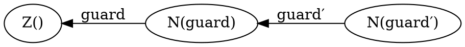

# Equivalence of Transition Systems: Simulation, Symmetric Simulation, and Bisimulation

Until now, we have discuss properties of systems through the lens of reachability properties, e.g., can a system get to a particular state.

Other types of questions we may want to ask  are
* How does a system interact with his environment? (its input/output behaviors)
* What it means for two systems to be equivalent? or implement the same interface?

Surely, two different implementations of the same protocol can have different states, so comparing them using state-based properties is not possible.
Simulation relations for labeled systems try to answer such questions.

## Labeled Transition Systems

A _labeled transition systems_ (LTS) is a triple $(S,Σ,→)$ with:
* $S$ is a set of states (can be infinite),
* $Σ$ is a finite set of labels (the alphabet),
* $→ ⊆ S × Σ × S$ is a transition relation.

## Simulation relations

We already saw an instance of simulation with the compatibility of WSTS.
In this case, it was a particular case of simulation relation within the same process.
However, this idea is more general and applicable to different processes.

Let $A$, $B$ be two LTS with the same alphabet $Σ$.
A _simulation relation_ $R$ a relation between the states of $A$ and $B$ with the following property:
$∀ a ∈ Σ,~ s_A,t_A ∈ S_A,~ s_B ∈ S_B.~ R(s_A, s_B) ∧ s_A \stackrel{a}{→_A} t_A ⇒ ∃ t_B ∈ S_B.~ s_B \stackrel{a}{→_B} t_B ∧ R(t_A, t_B)$.

If both $R$ and its inverse $R⁻¹$ are simulation relations then $R$ is a bisimulation.

We say that $A$ simulates $B$ if there is a simulation relation between $B$ and $A$ that covers all the reachable states of $B$ and relates the initials states of $A$ and $B$.

For two systems $A$ and $B$, it is possible to have $A$ simulating $B$, $B$ simulating $A$, and $A$,$B$ are not bisimilar.

__Example.__
Let us look at the following NFAs:
* $A$:
  ```graphviz
  digraph finite_state_machine {
      rankdir=LR;
      node [shape = circle];
      init [shape = none, label = ""];
      init -> a;
      a -> b [ label = "a" ];
      b -> c [ label = "b" ];
      c -> b [ label = "a" ];
      a -> d [ label = "a" ];
      d -> d [ label = "a,b" ];
  }
  ```
* $B$:
  ```graphviz
  digraph finite_state_machine {
      rankdir=LR;
      node [shape = circle];
      init [shape = none, label = ""];
      init -> 0;
      0 -> 1 [ label = "a" ];
      1 -> 2 [ label = "a" ];
      2 -> 1 [ label = "b" ];
      0 -> 3 [ label = "a" ];
      3 -> 3 [ label = "a,b" ];
  }
  ```

$A$ simulates $B$ with the following simulation relation: ${(0,a), (1,d), (2,d), (3,d)}$.

$B$ simulates $A$ with the following simulation relation: ${(a,0), (b,3), (c,3), (d,3)}$.

However, $A$ and $B$ are not bisimilar.


# Calculus of Communicating Systems (CCS)

All the model we have seen until now are state/automata-based models of concurrent systems.
Process calculi (CCS, CSP, π-calculus) provide an alternative approach to model concurrent system.
There models describe concurrent systems using equations and can reason about these systems by algebraic manipulations.

A key element of CCS is the distinction between _names_ and _process_.
_Names_ are channels and they are orthogonal to processes, e.g., a process can send or receive messages from _any_ name in its scope.
In the world of CSM, only a single process can receive from a channel.

You can find more information in the [notes on CCS by Emanuele D’Osualdo](https://www.tcs.cs.tu-bs.de/documents/ConcurrencyTheory_WS_20162017/ccs.pdf).

__Example.__

Let us revisit the ping-pong example and express it in CCS:
* ping:
  ```graphviz
  digraph finite_state_machine {
      rankdir=LR;
      node [shape = circle];
      init [shape = none, label = ""];
      A [label = "init"];
      B [label = "wait"];
      init -> A;
      A -> B [ label = "pong!Ping" ];
      B -> A [ label = "?Pong" ];
  }
  ```
  becomes \\[ ping() ≝~ !\text{Ping}.?\text{Pong}.ping() \\]
* pong:
  ```graphviz
  digraph finite_state_machine {
      rankdir=LR;
      node [shape = circle];
      init [shape = none, label = ""];
      A [label = "init"];
      B [label = "ack"];
      init -> A;
      A -> B [ label = "?Ping" ];
      B -> A [ label = "ping!Pong" ];
  }
  ```
  becomes \\[ pong() ≝~ ?\text{Ping}.!\text{Pong}.pong() \\]

Notice that CCS does not send messages to particular process but just a given _name_.

Furthermore, CCS allows us the processes to be parametric in the name they use:
\\[
\begin{array}{rcl}
    ping(x,y) & ≝ & !x.?y.ping(x,y) \\\\
    pong(x,y) & ≝ & ?x.!y.pong(x,y)
\end{array}
\\]

We have seen how to define processes.
Now we can compose them together: \\[ ping(a, b) ~|~ pong(a,b )\\]

By expanding the definitions we get \\[ !a.?b.ping(a, b) ~|~ ?a.!b.pong(a,b) \\]

Reduction synchronizes the sends ($!$) and receive ($?$).

\\[
!a.?b.ping(a, b) ~|~ ?a.!b.pong(a,b) \quad → \quad ?b.ping(a, b) ~|~ !b.pong(a,b) \quad → \quad ping(a, b) ~|~ pong(a,b) \quad  → \quad …
\\]

We can simplify the definitions even more by factoring out the common part:
\\[
\begin{array}{rcl}
    ping(x,y) & ≝ & !x.pong(y,x) \\\\
    pong(x,y) & ≝ & ?x.ping(y,x)
\end{array}
\\]


## Syntax

__Process definitions.__
A set of mutually recursive definitions of the form: $A(\vec a) ≝~ P$
where
* $A$ is the identifier of the process
* $\vec a$ is a list of (channel) _names_
* $P$ is a process

__Processes.__

$
\begin{array}{rcll}
   P & ::= & π.P            & \text{(action)}   \\\\
     &   | & P + P   \qquad & \text{(choice)}  \\\\
     &   | & P |~ P         & \text{(parallel composition)} \\\\
     &   | & (νa) P         & \text{(restriction)} \\\\
     &   | & A(\vec a)      & \text{(named process)} \\\\
     &   | & 0              & \text{(end)}
\end{array}
$

__Actions.__

$
\begin{array}{rcll}
   π & ::= & !a             & \text{(send)}   \\\\
     &   | & ?a    \qquad   & \text{(receive)}  \\\\
     &   | & τ              & \text{(silent)}
\end{array}
$

_Notations._
* For reading processes, the priority of the operation from strongest to weakest: action, restriction, choice, parallel.
* $!a$ and $?a$ is the CSP notation.
  Most publication on CCS and the π-calculus uses $\overline a$ for $!a$ and $a$ for $?a$.
* Sometimes $∥$ is used instead of $|$
* The binary choice $P+Q$ can be generalized to indexed sum $∑_i P_i$.
* For the labelled semantics, we write $\stackrel{π}{→}$ for a transition with the label $π$.
* We allow putting multiple names under the same restriction as shorthand: $(ν a b)$ instead of $(νa)(νb)$


## Free Names and Bound Names

To discuss in more details the equivalence of processes we need to define the set of _free names_ and _bound names_.

The free names ($fn$) are the names that occurs in a processes but are not restricted:
* $fn(0) = ∅$
* $fn(τ.P) = fn(P)$
* $fn(!a.P) = fn(P) ∪ \\{a\\}$
* $fn(?a.P) = fn(P) ∪ \\{a\\}$
* $fn(P + Q) = fn(P) ∪ fn(Q)$
* $fn(P | Q) = fn(P) ∪ fn(Q)$
* $fn((νa)P) = fn(P) ∖ \\{a\\}$
* $fn(A(\vec a)) = \\{\vec a\\}$

The dual of free names are bound names ($bn$).
The names occurring under a restriction:
* $bn(0) = ∅$
* $bn(π.P) = bn(P)$
* $bn(P + Q) = bn(P) ∪ bn(Q)$
* $bn(P | Q) = bn(P) ∪ bn(Q)$
* $bn((νa)P) = bn(P) ∪ \\{a\\}$
* $bn(A(\vec a)) = ∅$

_Remark._
Computing the free/bound name does not unfold the definitions.
It computes the set of bound/free names for a given formula.
Taking transitions changes the bound/free names.

__Examples.__
* In "$!x.0 | ?x.0$", $x$ is free and there are no bound name.
  After one step, the process becomes "$0|0$" which has no name at all.
* "$(νx)(!x.0 | ?x.0)$" has no free name and $x$ is a bound name.
* "$(νx)(!x.0) | ?x.0$" has $x$ both as free name and bound name.
  In that example, $x$ represents two different names.
  A simpler way of writing the same process is "$(νy)(!y.0) | ?x.0$".

Restriction defines a local scope and the name bound in that scope is not visible to the outside (like a local variable in program).
Processes are equivalent up to renaming of bound names.
Renaming bound names is called α-conversion.

__Substitution.__
To rename free names in a formula, we use substitution.
Substitution never change the bound names.
$P[y/x]$ is the substitution of free instances of $x$ by $y$ in $P$.

For instance, $((νx)(!x.0) | ?x.0)[y/x] = (νx)(!x.0) | ?y.0$.

__No clash assumption.__
W.l.o.g. we assume that $fn(P) ∩ bn(P) = ∅$.

This prevents the ambiguous case we saw above: $(νx)(!x.0) | ?x.0$.
Using α-conversion, we can always rename the bound names to make bound and free names different.
For instance, $(νz)(!z.0) | ?x.0$ is an equivalent process with respect the no clash assumption.

Is it still possible to bind the same name in parallel: $(νx)(!x.0) | (νx)(?x.0)$.

__Closed definitions.__
Furthermore, when we have a definition $A(\vec a) ≝~ P$, we assume that $fn(P) ⊆ \\{\vec a \\}$.
This can potentially require adding extra parameters to the argument until all the free names are bound by the definition.


## Semantics (version 1)

* Action
  \\[{
  }\over{
  π.P  \stackrel{π}{→}  P
  }\\]
* Choice 1 & 2
  \\[{
    P  \stackrel{π}{→}  P'
  }\over{
    P+Q  \stackrel{π}{→}  P'
  }\\]
  \\[{
    Q  \stackrel{π}{→}  Q'
  }\over{
    P+Q  \stackrel{π}{→}  Q'
  }\\]
* Parallel 1 & 2
  \\[{
    P  \stackrel{π}{→}  P'
  }\over{
    P|Q  \stackrel{π}{→}  P'|Q
  }\\]
  \\[{
    Q  \stackrel{π}{→}  Q'
  }\over{
    P|Q  \stackrel{π}{→}  P|Q'
  }\\]
* Communication 1 & 2
  \\[{
    P  \stackrel{!a}{→}  P' \qquad
    Q  \stackrel{?a}{→}  Q'
  }\over{
    P|Q  \stackrel{τ}{→}  P'|Q'
  }\\]
  \\[{
    P  \stackrel{?a}{→}  P' \qquad
    Q  \stackrel{!a}{→}  Q'
  }\over{
    P|Q  \stackrel{τ}{→}  P'|Q'
  }\\]
* Restriction
  \\[{
    P  \stackrel{π}{→}  P' \qquad π ≠ !a \qquad π ≠ ?a
  }\over{
    (νa)P  \stackrel{π}{→}  (νa)P'
  }\\]
* Definition
  \\[{
    A(\vec x) ≝~ P \qquad  P[\vec y/ \vec x] \stackrel{π}{→} P' \qquad \\{\vec y\\} ∩ bn(P) = ∅
  }\over{
    A(\vec y) \stackrel{π}{→}  P'
  }\\]

__Example.__
To create new processes, we can use the parallel composition inside a definition:

$\begin{array}{lcl}
spawn() & ≝ & P(…) ~|~ spawn() \\\\
P(…) & ≝ &  …
\end{array}$

__Example.__
Choice represents alternatives, or branches.
In the world of CSM, choice is the outgoing edges from a state.

Let us look at a vending machine example:

$\begin{array}{lcl}
\text{Zero}() & ≝ & ?coin.\text{One}() \\\\
\text{One}()  & ≝ & ?coin.\text{Two}() ~+~ !water.\text{Zero}() \\\\
\text{Two}()  & ≝ & !coffee.\text{Zero}() ~+~ !water.\text{One}()
\end{array}$

__Example.__
The silent action $τ$ represents internal action, i.e., action that are not precisely observable from the outside.
$τ.0$ and $(νx)(?x.0 | !x.0)$ are different but from the point of view of an external observer, they behave the same.

The notion of bisimulation we have seen is called _strong_ bisimulation.
It still allows comparing the number of internal steps when comparing processes.

## Internal Choice

$τ$ is also useful to represent internal choice.
Let us try to have a process that models a coin flip:

$\begin{array}{lcl}
\text{flip}() & ≝ & !head.0 + !tail.0 \\\\
\text{gambler}()  & ≝ & ?head.0
\end{array}$

Then in the process $(νhead)(νtail)(flip() | gambler())$, the gambler always win and the process reduces to $0$.

A better model is

$\begin{array}{lcl}
\text{flip}() & ≝ & τ.!head.0 + τ.!tail.0 \\\\
\text{gambler}()  & ≝ & ?head.0
\end{array}$

In that case the process $(νhead)(νtail)(flip() | gambler())$ can get to $(νhead)(νtail)(!tail.0 | gambler())$ and get stuck.


## Open vs Closed World

The semantics above is an _open world_ semantics.
It is possible to make send/receive steps that are not matched.

For instance, we have $?x.0 \stackrel{?x}{→ } 0$.

Similarly, (a) $(νx)(?x.0 | !x.0)$ is not the same as (b) $?x.0 | !x.0$:
* (a) only has a single possible transition: $(νx)(?x.0 | !x.0) ~~ \stackrel{τ}{→} ~~ (νx)(0 | 0)$
* (b) can execute 3 different sequences:
  - $?x.0 | !x.0  ~~ \stackrel{τ}{→} ~~ 0 | 0$
  - $?x.0 | !x.0  ~~ \stackrel{?x}{→} ~~ 0 | !x.0 ~~ \stackrel{!x}{→} ~~ 0 | 0$
  - $?x.0 | !x.0  ~~ \stackrel{!x}{→} ~~ ?x.0 | 0 ~~ \stackrel{?x}{→} ~~ 0 | 0$

A process $P$ is closed if $fn(P) = ∅$.


## Synchronous and Asynchronous Communication

Exchanging messages is a synchronous operation.
However, it is possible to emulate asynchronous communication without changing the calculus.
In a process by using $!a.0 | P$ instead of $!a.P$ we can express asynchronous communication with unbounded and unordered channels.

For instance, the asynchronous version of ping-pong is:

$\begin{array}{lcl}
ping(x,y)  & ≝ & !x.0 ~ | ~ pong(y,x) \\\\
pong(x,y)  & ≝ & ?x.ping(y,x)
\end{array}$

It is interesting to notice that in CCS, asynchronous communication is a subset of the full calculus where $!a$ can only be followed by $0$.


## Alternative Views on Definitions/Recursion

Instead of using a set of mutually recursive definition, it is possible to have a _recursion_ operator.

The process definition get the additional elements:

$
\begin{array}{rcll}
   P & ::= & …              & \\\\
     &   | & μX.P    \qquad & \text{(recursion)}  \\\\
     &   | & X              & 
\end{array}
$

and $A(\vec a)$ is removed.

In the semantics the definition rule is replaced by:
\\[{
P[μX.P/X] \stackrel{π}{→}  P'
}\over{
  μX.P \stackrel{π}{→}  P'
}\\]

The ping-pong example becomes: $μX.!\text{Ping}.?\text{Pong}.X ~|~ μY.?\text{Ping}.!\text{Pong}.Y$.


## Structural Congruence

Notice that some reduction rules are _doubled_ to deal with the binary operator and send/receive duality.
It is possible to simplify this if we can factor out simple rewritings that result in bisimilar processes.

The structural congruence relation ($≡$) help simplify the transition rules (and much more).

The congruence is an equivalence relation and, therefore, it respects:
* $P ≡ P$
* $P ≡ Q ⇒ Q ≡ P$
* $P ≡ Q ∧ Q ≡ R ⇒ P ≡ R$

Then there are rules to manipulate the operators:
* actions
  - $P ≡ Q  ⇒  π.P ≡ π.Q$
* $+$
  - $P+0 ≡ P$
  - $P+P ≡ P$
  - $P+Q ≡ Q+P$
  - $(P+Q)+R ≡ P+(Q+R)$
  - $P ≡ Q  ⇒  P+R ≡ Q+R$
* $|$
  - $P|0 ≡ P$
  - $P|Q ≡ Q|P$
  - $(P|Q)|R ≡ P|(Q|R)$
  - $P ≡ Q  ⇒  P|R ≡ Q|R$
* $(νa)$
  - $(νa)(νb)P ≡ (νb)(νa)P$
  - $(νa)(P+Q) ≡ (νa)P + (νa)Q$
  - $a ∉ fn(P) ⇒ (νa)P ≡ P$
  - $a ∉ fn(P) ⇒ (νa)(P|Q) ≡ P | (νa)Q$ (_scope extrusion_)
  - $π ≠ ?a ∧ π ≠ !a ⇒ (νa)π.P ≡ π.(νa)P$
  - $π = ?a ∨ π = !a ⇒ (νa)π.P ≡ 0$
  - $b ∉ fn(P) ∧ b ∉ bn(P) ⇒ (νa)P ≡ (νb)P[b/a]$
  - $P ≡ Q  ⇒  (νa)P ≡ (νa)Q$
* definition
  - $A(\vec x) ≝ P ∧ \\{\vec y\\} ∩ bn(P) = ∅ ⇒  A(\vec y) ≡ P[\vec y/\vec x]$


__Theorem.__
$≡$ is a bisimulation, i.e., $P ≡ P' ∧  P\stackrel{π}{→} Q  ⇒  ∃ Q'. Q ≡ Q' ∧  P' \stackrel{π}{→} Q'$.


_Proof Sketch._
By case split on the formula and the transition rules.
We come to a few cases:
* $P ≡ Q  ⇒  π.P ≡ π.Q$:
  - We can apply the action rule on $π.P$ and $π.Q$ we get $π.P\stackrel{π}{→}P$ and $π.Q\stackrel{π}{→}Q$.
  - Then the hypothesis ($P≡Q$) completes that case.
* $P+P ≡ P$:
  - If $P\stackrel{π}{→}P'$ we can apply the choice rule on $P+P$ and $P\stackrel{π}{→}P'$ to get $P'$. $P'≡P'$ by reflexivity of $≡$.
  - If $P+P\stackrel{π}{→}P'$ take a transition $π$ then in must involve choice (no other rule match $+$) and we can deduce $P\stackrel{π}{→}P'$.
* $P+Q ≡ Q+P$:
  - by substituting choice 1 and choice 2 rule in when taking transitions.
* …


Structural congruence gives us the possibility to compare processes by rewritting.
If a process can be rewritten into the other, they are bisimilar.


## Semantics (version 2)

With the congruence relation we can have an alternative and sightly simpler definition of the semantics.

* Action
  \\[{
  }\over{
  π.P  \stackrel{π}{→}  P
  }\\]
* Choice
  \\[{
    P  \stackrel{π}{→}  P'
  }\over{
    P+Q  \stackrel{π}{→}  P'
  }\\]
* Parallel
  \\[{
    P  \stackrel{π}{→}  P'
  }\over{
    P|Q  \stackrel{π}{→}  P'|Q
  }\\]
* Communication
  \\[{
    P  \stackrel{!a}{→}  P' \qquad
    Q  \stackrel{?a}{→}  Q'
  }\over{
    P|Q  \stackrel{τ}{→}  P'|Q'
  }\\]
* Restriction
  \\[{
    P  \stackrel{π}{→}  P' \qquad π ≠ !a \qquad π ≠ ?a
  }\over{
    (νa)P  \stackrel{π}{→}  (νa)P'
  }\\]
* Congruence
  \\[{
    P ≡ P' \qquad P' \stackrel{π}{→} Q' \qquad Q' ≡ Q
  }\over{
    P \stackrel{π}{→} Q
  }\\]

## Strong Ground Equivalence

Structural congruence is limited to simple rewriting.
In particular, it cannot compare $+$ and $|$.
For instance, consider the following two processes: $!a.!b.0 + !b.!a.0$ and $!a.0 | !b.0$.

Strong ground equivalence of two processes (written $SGE ⊢ P = Q$) will allows us to deal with the case above.

Before we can define SGE we need a few extra notions.

In a process $P$, $A$ is _unguarded_ if there is an occurrence of $A$ which is not under a prefix.

We can _observe_ $α$ in a process $P$ if $α.A$ occurs unguarded in $P$ for some $A$.
It is written $P↓_α$ and $α.A$ is called a _commitment_.

The _commitment relation_ $≻$ is the smallest relation satisfying:

\\[{
}\over{
α.P + Q ≻ α.P
}\\]

\\[{
P ≻ !a.A \\qquad Q ≻ ?a.B
}\over{
  P|Q ≻ τ.(A | B)
}\\]

\\[{
   P ≻ α.A
}\over{
P|Q ≻ α.(A | Q)
}\\]

\\[{
P ≻ α.A \qquad  α ∉ {?x, !x}
}\over{
   (νx)P ≻ α.(νx)A
}\\]

\\[{
P ≡ P' \qquad P' ≻ α.Q' \qquad Q ≡ Q'
}\over{
        P ≻ α.Q
}\\]

The idea is that every process is semantically congruent to a set of commitments.
We can think as $P$ bisimilar to $Q$ if they are committed to bisimilar processes.

More importantly, the commitment relation points the way to an expansion theorem that relates choice ($+$) and composition ($|$).

__Theorem.__ (expansion law)

$
\begin{array}{lll}
SGE ⊢ P|Q & = & ∑ \\{α.(A | Q) ~~ \text{where} ~~ P ≻ α.A \\} \\\\
          & + & ∑ \\{β.(B | P) ~~ \text{where} ~~ Q ≻ β.B \\} \\\\
          & + & ∑ \\{τ.(A | B) ~~ \text{where} ~~ (P ≻ !a.A ∧ Q ≻ ?a.B) ∨ (P ≻ ?a.A ∧ Q ≻ !a.B) \\}
\end{array}
$

__Example.__
Applying the expansion law to the example above:

$
SGE ⊢ !a.0 | !b.0 = !a.(0 | !b.0) + !b.(!a.0 | 0)
$

_SGE_ is the combination of $≡$ and the expansion law:
* structural congruence:i
  
  $P≡Q  ⇒  SGE ⊢ P=Q$

* expansion law:

  $
  \begin{array}{lll}
  SGE ⊢ P|Q & = & ∑ \\{α.(A | Q) ~~ \text{where} ~~ P ≻ α.A \\} \\\\
            & + & ∑ \\{β.(B | P) ~~ \text{where} ~~ Q ≻ β.B \\} \\\\
            & + & ∑ \\{τ.(A | B) ~~ \text{where} ~~ (P ≻ !a.A ∧ Q ≻ ?a.B) ∨ (P ≻ ?a.A ∧ Q ≻ !a.B) \\}
  \end{array}
  $

__Example.__
By mixing the expansion law and structural congruence to the example above, we get:

$
\begin{array}{lll}
SGE ⊢ ~~ !a.0 | !b.0 & = & !a.(0 | !b.0) + !b.(!a.0 | 0) \\\\
                     & = & !a.!b.0 + !b.!a.0
\end{array}
$

__Theorem.__
SGE is a bisimulation.

__Theorem.__
If $P$ and $Q$ are bisimilar and finite (no recursion) then $SGE ⊢ P = Q$.


## Counting with CCS

We have seen a way of proving that two processes are bisimilar.
A next step is to ask if it is complete and can be automated.
Unfortunately, this is not possible in general and we can show that by encoding Minsky machines.
CCS is Turing-complete and, therefore, most questions about CCS are undecidable.
(Bisimulation is a reachability problem.)

The feature that makes CCS so expressive is the combination of restriction and parallel composition.

To encode counters, we will chain processes in a list where the length of the list is the value.
We use 4 free names:
* $zero$: a counter with value $0$ will send a $zero$ message.
* $nonzero$: a counter with value $>0$ will send a $nonzero$ message.
* $increment$: when receiving an $increment$ message, the counter will increment its value.
* $decrement$: a non-zero counter will decrease its value on receiving $decrement$.

$zero$ and $nonzero$ implements the test for 0 in counter machines.
$increment$ and $decrement$ the $+1$ and $-1$ operations.

Here is the full definition of the counter:

$\begin{array}{lllll}
\text{Z}()      & ≝ & !zero.\text{Z}()         & + & ?increment.(νguard)(?guard.\text{Z}() | \text{N}(guard)) \\\\
\text{N}(guard) & ≝ & !nonzero.\text{N}(guard) & + & ?increment.(νguard')(?guard'.\text{N}(guard) | \text{N}(guard')) + ?decrement.!guard.0
\end{array}$

$Z$ stands for zero and $N$ for non-zero.

For the test for zero, $Z$ sends a $zero$ message and continues as itself.
$N$ is similar with $nonzero$.

The difficult part is the increment.
In the increment, we create two $N$ processes.
The first $N$ is the value before the increment which is _guarded_ by a fresh name: $?guard'.N(guard)$.
The second $N$ is the value after the increment and if hold the guard of the previous value.

In some sense, the previous value is "hidden" inside the new guard.
Since, the new guard is restricted it cannot be called from the outside.
The only way to remove the guard is to call $decrement$.

__Example.__
Let us look at a sequence of operations:
* initial configuration: $Z() | !increment.!increment.!decrement.0$
* after the 1st increment: $(νguard)(?guard.Z() | N(guard)) | !increment.!decrement.0$
* after the 2nd increment: $(νguard)(?guard.Z() | (νguard')(?guard'.N(guard) | N(guard'))) | !decrement.0$
* after some rewriting ($≡$): $(νguard)(νguard')(N(guard') | ?guard'.N(guard) | ?guard.Z() | !decrement.0)$
* after during the decrement: $(νguard')(νguard)(!guard'.0 | ?guard'.N(guard) | ?guard.Z() | 0)$
* after after the decrement: $(νguard')(νguard)(0 | N(guard) | ?guard.Z() | 0)$
* after some rewriting ($≡$): $(νguard)(N(guard) | ?guard.Z())$

Visually, it "looks" like:

